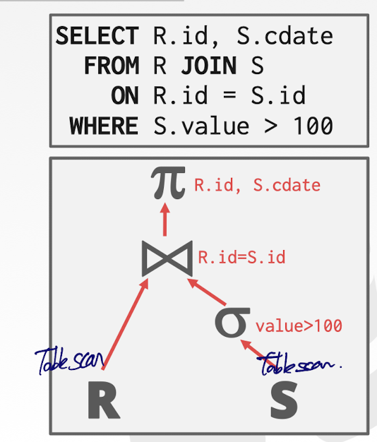
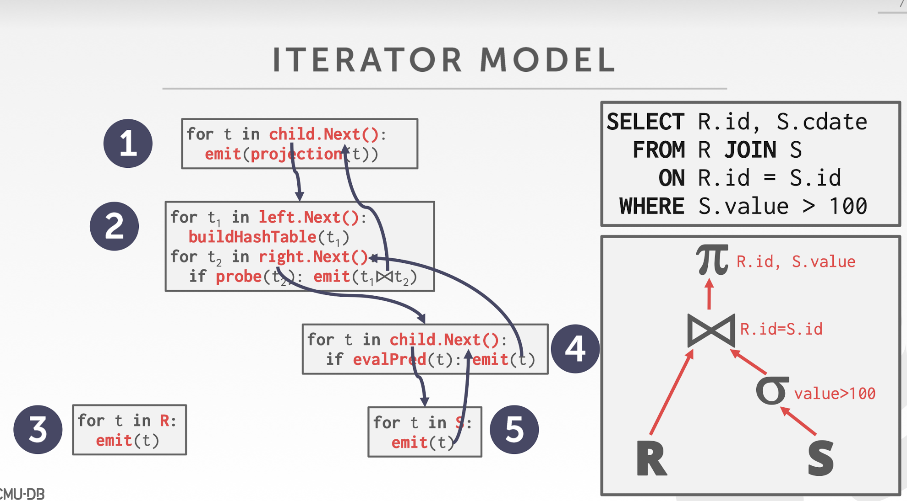

## Notice

This posting is based on Prof. Andy Pavlo's CMU 15.445.645 Intro to Database Systems (Fall 2021) lecture.  
Lecture link : [https://15445.courses.cs.cmu.edu/fall2021/](https://15445.courses.cs.cmu.edu/fall2021/)

  
## Query Plan 
- Collection of operators in our DBMS
- The operators are arranged in a tree, technically DAG(Directed Acyclic Graph)
- Data flows from the leaves of the tree up towards the root
- The output of the root node is the result of the query

### Steps
  

1. Translate the SQL to the logical plan
2. Logical plan is going to be translated again to a physical plan
   1. Physical plan is the plan where we take each of the operators and decide what the physical implementation of that operator is going to be
   - Ex ) Join in this example, we can use nested loop join / hash join ... 

# Processing Model
A DBMS's processing model defines how the system executes a query plan  
-> Different trade-offs for different workloads  
<u>There are different ways that we can implement passing results between different query operators. Each operator implemented in isolation and now we need to move intermediate results between the operators</u>
- Approach #1 : Iterator Model
- Approach #2 : Materialization Model
- Approach #3 : Vectorized / Batch Model

## Iterator Model
Most common and famous approach, also called as Volcano style query processing, Pipeline model.  
Each query plan operator implements a Next() function
- On each invocation, the operator returns either a single tuple or a null marker if there are no more tuples
- The operator implements a loop that calls Next() on its children to retrieve their tuples and then process them

### Example
  
Executing order is below  
  

### Summary
- Used in almost every DBMS. Allows for tuple pipelining
  - Let's look at arrows in the above figure. Every single tuple we emit is going to be pushed or pulled up by the parent operator all the way through the query plan
  - Want to maximize the amount of work we are able to perform on the tuple once we go and get it from disk / We are going to get the tuple and propagate it or pipeline it as much as possible through all of the operators that we have in our query plan
- Some oeperators must block until their children emit all their tuples
  - Joins, Subqueries, Order By
  - In the above figure, we need to wait to execute the right side of the query(the probe pahse of the join) until left side of the query(the build phase) has emitted all of the tuples
- Output control works easily with this approach
  - like LIMIT Clause