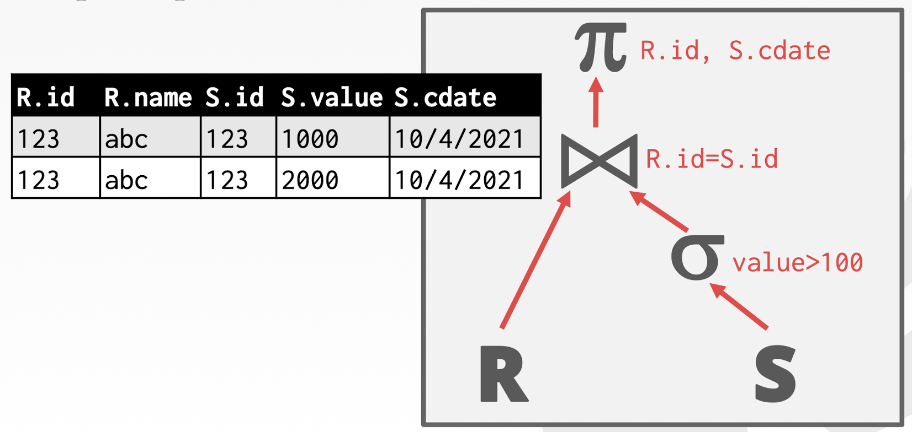
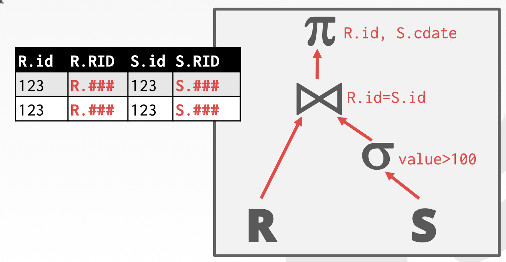
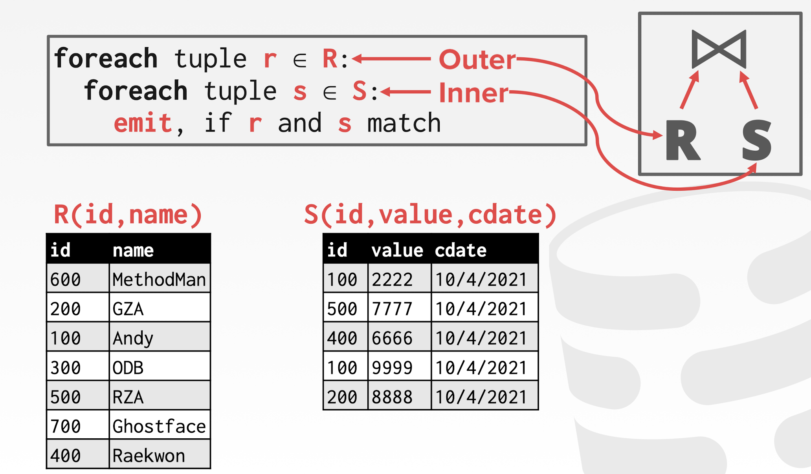
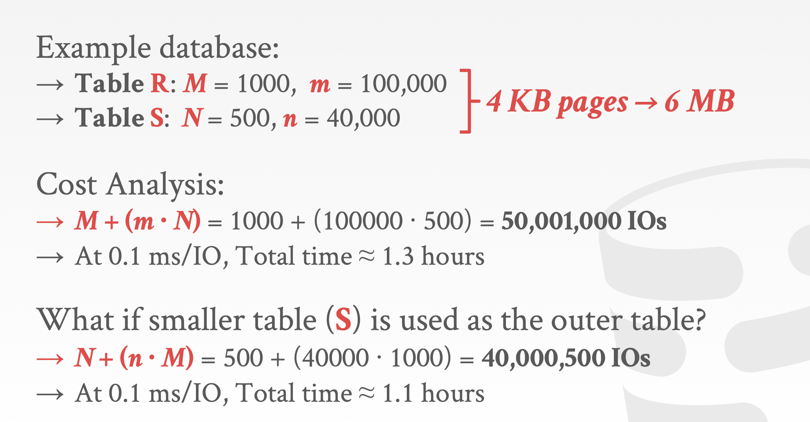

## Notice

This posting is based on Prof. Andy Pavlo's CMU 15.445.645 Intro to Database Systems (Fall 2021) lecture.  
Lecture link : [https://15445.courses.cs.cmu.edu/fall2021/](https://15445.courses.cs.cmu.edu/fall2021/)

  
## Query Plan 
- Collection of operators in our DBMS
- The operators are arranged in a tree, technically DAG(Directed Acyclic Graph)
- Data flows from the leaves of the tree up towards the root
- The output of the root node is the result of the query

### Steps
  

1. Translate the SQL to the logical plan
2. Logical plan is going to be translated again to a physical plan
   1. Physical plan is the plan where we take each of the operators and decide what the physical implementation of that operator is going to be
   - Ex ) Join in this example, we can use nested loop join / hash join ... 

# Processing Model
A DBMS's processing model defines how the system executes a query plan  
-> Different trade-offs for different workloads  
<u>There are different ways that we can implement passing results between different query operators. Each operator implemented in isolation and now we need to move intermediate results between the operators</u>
- Approach #1 : Iterator Model
- Approach #2 : Materialization Model
- Approach #3 : Vectorized / Batch Model

## Iterator Model
Most common and famous approach, also called as Volcano style query processing, Pipeline model.  
Each query plan operator implements a Next() function
- On each invocation, the operator returns either a single tuple or a null marker if there are no more tuples
- The operator implements a loop that calls Next() on its children to retrieve their tuples and then process them

### Example
  
Executing order is below  
  

### Summary
- Used in almost every DBMS. Allows for tuple pipelining
  - Let's look at arrows in the above figure. Every single tuple we emit is going to be pushed or pulled up by the parent operator all the way through the query plan
  - Want to maximize the amount of work we are able to perform on the tuple once we go and get it from disk / We are going to get the tuple and propagate it or pipeline it as much as possible through all of the operators that we have in our query plan
- Some oeperators must block until their children emit all their tuples
  - Joins, Subqueries, Order By
  - In the above figure, we need to wait to execute the right side of the query(the probe pahse of the join) until left side of the query(the build phase) has emitted all of the tuples
- Output control works easily with this approach
  - like LIMIT Clause

##  Materialization Model
Each operator processes its input all at once and then emits its output all at once
- The operator "materializes" its output as a single result
- The DBMS can push down hints (e.g. LIMIT) to avoid scanning too many tuples
- Can send either a materialized row or a single column

The output can be either whole tuples (NSM) or subsets of columns (DSM)
### Example
  
Extreme opposite of operator at a time processing  
Do the entire operation on every single tuple for that operator, and we done with it then move on to the next operator

### When tuple at a time iterator based processing is good ? 
Better for OLTP workloads
- queries only access a small number of tuples at a time
  - Lower execution / coordination overhead
  - Fewer function calls

<u>Not good for OLAP queries with large intermediate results</u>  

## Vectorization Model
Like the Iteratol Model where each operator implements a Next() function, but  
Each operator emits a batch of tuples instead of a single tuple
- The operator's internal loop processes multiple tuples at a time
- The size of the batch can vary based on hardware or query properties

### Example
  
It seems hybrid of iterator model and materialization model. 

### Advantages
- Ideal for OLAP queries because it greatly reduces the number of invocations per operator
- Allows for operators to more easily use vectorized (SIMD) instructions to process batches of tuples

## Plan Processing Direction
1. <b> Top-to-Bottom (pull-based model) : In most case </b>
    - Start with the root and "Pull" data up from its children 
    - Tuples are always passed with function calls
2. Bottom-to-Top
    - Start with leaf nodes and push data to their parents
    - Allows for tighter control of caches/registers in pipelines
    - Advantages : when you have tighter control of caching and registers during your query processing, it is much better to pipeline the data

# Access Methods
An access method is the way that the DBMS accesses the data stored in a table
- Not defined in relational algebra

Three basic approaches :
- Sequential Scan
- Index Scan
- Multi-Index / Bitmap Scan

## Sequential Scan 
For each page in the table : 
- Retrieve it from the buffer pool
- Iterate over each tuple and check whether to include it

The DBMS maintains an internal cursor that tracks the last page / slot it examined

### Optimizations
This is almost always the worst thing that the DBMS can do to execute a query

Sequential Scan Optimizations :
- Prefetching
- Buffer Pool Bypass
- Parallelization
- Heap Clustering
- Zone Maps
- Late Materialization

#### Zone Maps
Pre-computed aggregates for the attribute values in a page. DBMS checks the zone map first to decide whether it wants to access the page.  

Examples  
  
In this query, after watching zone maps, we can decide that we don't need to scan the original data. Because the max is 400, so no value in the original data.  

Problem  
Everytime you update the tuple, have to update the zone maps. 

#### Late Materialization
DSM(Column-Store Model) DBMSs can delay stitching together tuples until the uppe rparts of the query plan.   
Examples  
  

## Index Scan
The DBMS picks an index to find the tuples that the query needs  

Which index to use depends on:
- What attributes the index contains
- What attributes the query references
- The attributes the query references
- Predicate composition
- Whether the index has unique or non-unique keys

Examples  
  

## Multi-Index SCan
If there are multiple indexes that the DBMS can use for a query :
- Computer sets of Record IDs using each matching index
- Combine these sets based on the query's predicates (union vs intersect)
- Retrieve the records and apply any remaining predicates

Postgres calls this Bitmpa Scan  

Examples  
  

# Modification Queries 
  
  

# Expression Evaluation
  
  

# Conclusion
- The same query plan can be exeucted in multiple different ways
- (Most) DBMSs will want to use index scans as much as possible rather than full table scan
- Expression trees are flexible but slow
