## Notice

This posting is based on Prof. Andy Pavlo's CMU 15.445.645 Intro to Database Systems (Fall 2021) lecture.  
Lecture link : [https://15445.courses.cs.cmu.edu/fall2021/](https://15445.courses.cs.cmu.edu/fall2021/)

  
## Today's Class
- going to discuss specifically how we can generalize this execution to multiple workers 

## Why care about parallel execution? 

- Internal Side : Increased performance
  - Throughput
    - If about transactional workload, it has a lot of concurrent transactions 
    - Latency
    - Analyticial side, e.g. OLAP, if you have a long running query, then you need to complete it as quickly as possible

- External Side : Increased responsiveness and availability 

- Potentially lower total cost of ownership (TCO)  

## Parallel VS Distributed

### Similarities 

Database is spread out across multiple resources,e.g. hardware resourses like cpus, disks, machines, servers, data centers, to improve different aspects of the DBMS  
Appears as a single logical database instance to the application, regardless of physical organization : <u>we want this to be completely transparent to the application</u>
- SQL query for a single-resource DBMS should generate same result on a parallel or distributed DBMS

### Differences 
- Parallel DBMSs
  - Resources are physically close to each other e.g. multiple coers, multiple cpus, multi-socket machine 
  - Resources communicate over high-speed interconnect e.g. shared memory or same disk
  - Communication is assumed to be cheap and reliable
- Distributed DBMSs
  - Resources can be far from each other
  - Resources communicate using slow(er) interconnect
  - Communication cost and problems cannot be ignored
    - Faults that occur in communication is important for our applications the DBMS to be fault tolerant
      - e.g. if you have network partitions or dropped or lost packets inter data center or inter node communication, then you can run iinto problems with the correctness of your application

# Process Model

A DBMS's process model defines how the system is architected to support concurrent requests from a multi-user applicaiton  
A worker is the DBMS component that is responsible for executing tasks on behalf of the client and returning the results  

## Approach #1: Process per DBMS Worker
Each worker is a separate OS process
- Relies on OS scheduler
- Use shared-memory for global data structures
- A process crash doesn't take down entire system
- Examples: IBM DB2, Postgres, Oracle 

### High-Level Overview
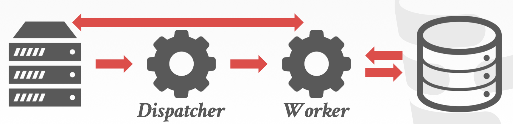  
1. Applications on the left, application is going to submit its requests(e.g. query) to the dispatcher layer
2. Dispatcher is going to fork off new process specifically to handle this application's query
3. This worker is going to manage all of the logic needed to execute the query from the client, and it's going to communicate back and forth the results back to the client

Why these systems use process per worker approach rather than threading based approach ?  
It's because they are old. When they came out there are no portable threading libraries. 

## Approach #2: Process Pool
A worker uses any free process from the pool, Similar to previous one, but rather than forking a new process for each client that connects to the dispatcher, we essentially allocate this worker pool of processes
- Still relies on OS scheduler and shared memory
- Bad for CPU cache locality
- Examples : IBM DB2, Postgres(2015)

### High-Level Overview
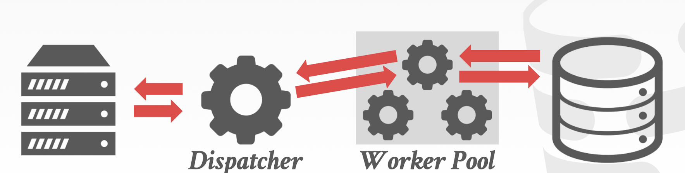  
When one of our request comes in, the dispatcher can route it to any free worker process in the pool  
Still rely on the OS scheduler in shared memory or some inter-process communication mechanism to communicate between them  
It can be bad for a CPU cache locality because if we don't have any control over when processes are being scheduled, descheduled or swapped out. There is no way to control what is running concurrently

## Approach #3: Thread per DBMS Worker
Single process with multiple worker threads  
Approach that become dominant in recent 10 years
- DBMS manages its own scheduling
- May or may not use a dispatcher thread
- Thread crash (may) kill the entire system
- Examples: IBM DB2, MSSQL, MySQL, Oracle(2014)
- tradeoff : thread crash might cause your entire process to crash

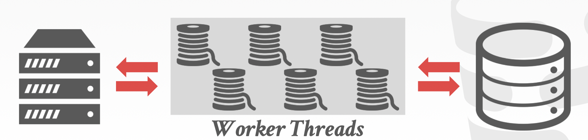  

## Process Models Wrap Up
Advantages of multi-threaded architecture :
- Less overhead per context switch
- Do not have to manage shared memory  

The thread per worker model does not mean that the DBMS supports intra-query parallelism

## Scheduling
For each query plan, the DBMS decides where, when, and how to execute it
- How many tasks should it use?
- How many CPU cores should it use?
- What CPU core should the tasks execute on?
- Where should a task store its output?

The DBMS always knows more than the OS

# Execution Parallism
## Inter- VS. Intra- Query Parallelism

Inter-Query: Different queries are executed concurrently
- Improve overall performance by allowing multiple queries to execute simultaneously
- If queries are read-only, then this requires little coordination between queries. But we don't have to worry about concurrent updates or race conditions 
- If multiple queries are updating the database at the same time, then this is hard to do correctly
- Increases throughput & reduces latency

Intra-Query: Execute the operations of a single query in parallel
- Improve the performance of a single query by executing its operators in parallel
- Think of organization of operators in terms of a producer / consumer paradigm
- There are parallel versions of every operator
  - Can either have multiple threads access centralized data structures or use partitioning to divide work up
- Decreases latency for long-running queries

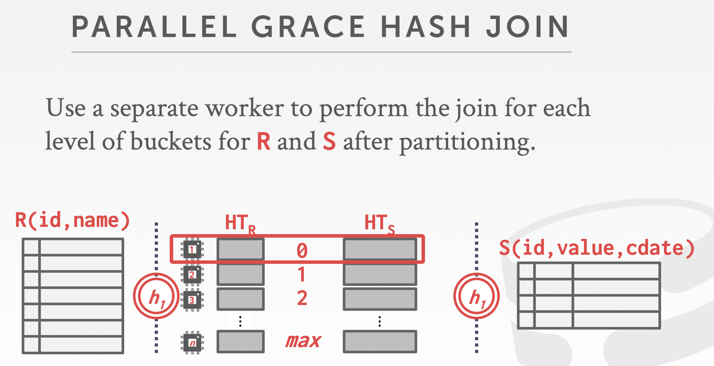  

We have all of our seperate workers, and each worker is going to take a disjoint partition of this hash join. For example, our first worker could get partition 0 and all of the other workers can do their local join without having to worry about what's going on in worker one with partition 0. This can be happen parallel and we have no coordination problems. 

## Intra- Query Prallelism
### Approach #1: Intra-Operator (Horizontal)
- Decompose operators into independent fragments that perform the same function on different subsets of data

The DBMS inserts an exchange operator into the query plan to coalesce/split results from multiple children/ parent operators. Part of volcano processing model  

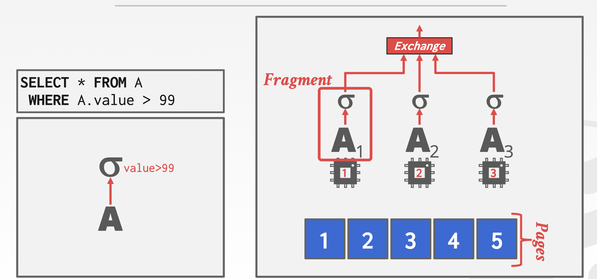  
Let's say we have 3 workers that we want to split this processing across.  
We have smaller table scan $A_1$, $A_2$, $A_3$. They are going to read disjoint partitions of table A and the selections can proceed in parallel and they are all going to get fed up to this exchange operator at the end.  

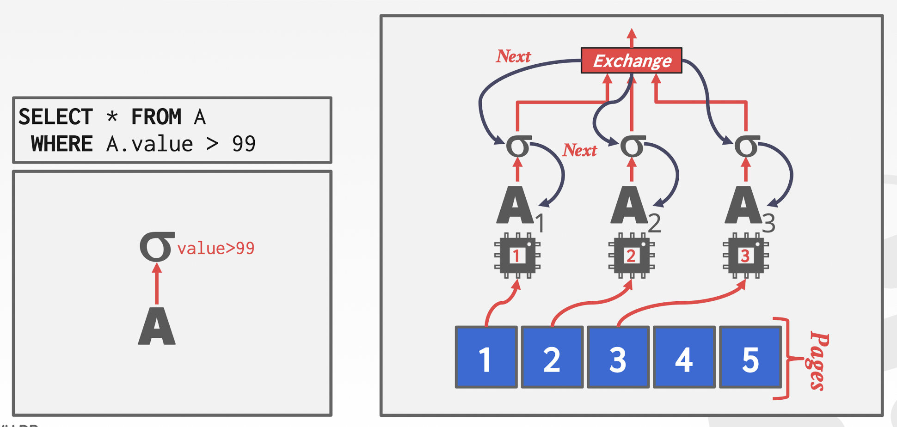  
What the exchange operator going to do is going to call next on each of its child fragments. It's going to call next to the first fragment, then the selection operator for the first frame is going to call next on the table scan and that proceeds as usual so in order to perform the table scan, this first fragment one table scan here is going to pull out the first page from the table on disk. And same thing happens for the other two fragments, where they are going to pull out the second and third pages from disk.  

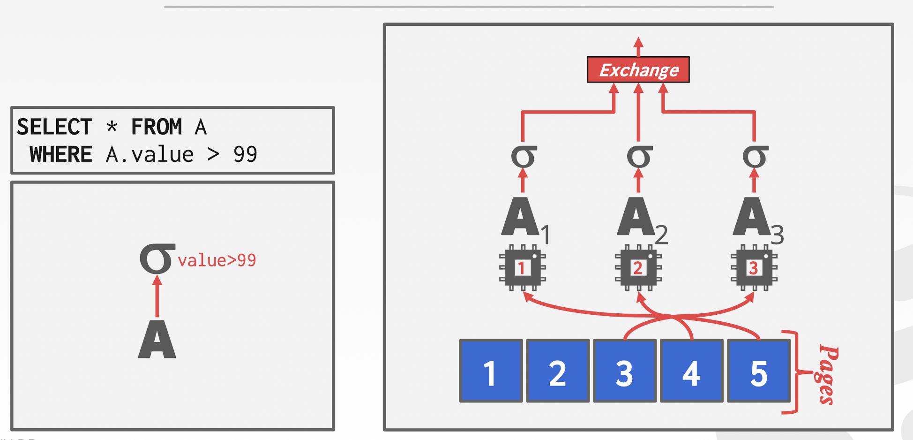  
And they are done, e.g. $A_1$, $A_2$ finished, and $A_3$ is still working, then $A_1$, $A_2$ can grab the next pages from disk.  

  

### Exchange Operator
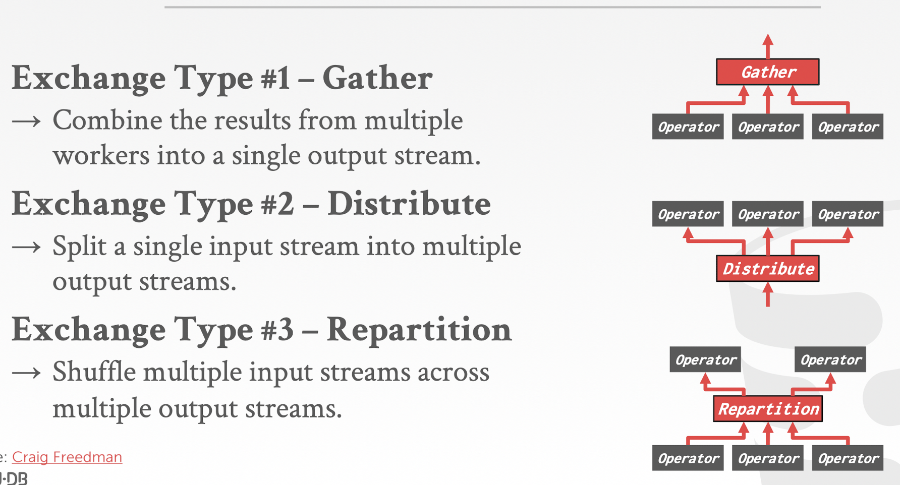  
- Gather : 
  - The previous example was Gather Type 
  - Collect all of the resulsts from our different selection operators or selection fragments and then put those into some final output stream to return to the user application

### Complicate Example 
We have operator like JOIN, this becomes more complicated  
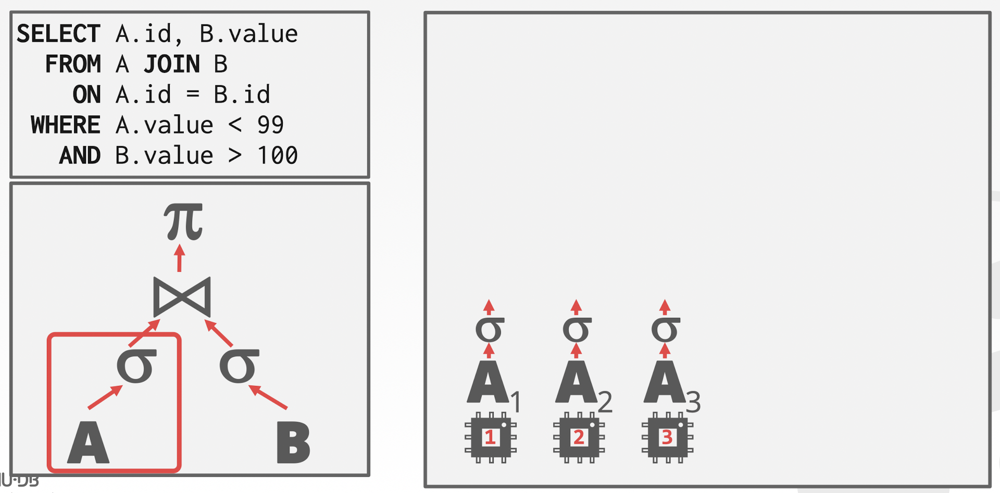  
1. We need to scan on A. So we split to 3 worker fragments that can scan in paralle on A. We can execute the selection in parallel because the different disjoint sub-ranges or sub-pages that we are working on aren't going to conflict with each other

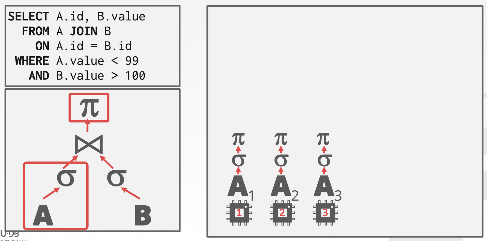  
2. Also we can do other thing, we can take this projection operator and push down them to the end. 

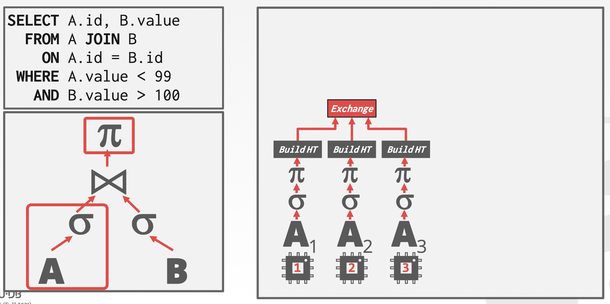  
3. Build independent hash tables, so each pipeline builds up its own independent hash table each fragment has its own hash table and then we use this exchange operator to combine them into one giant hash table. 

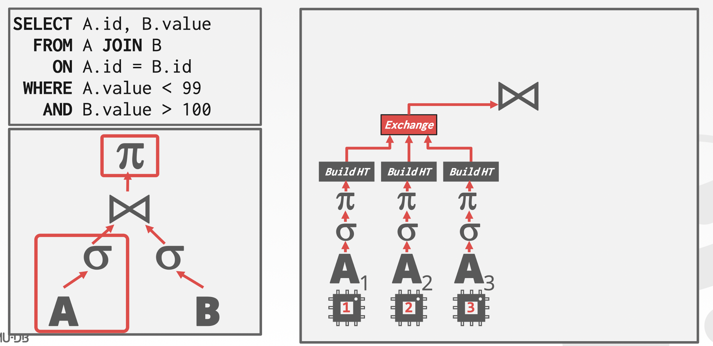  
4. We combine these different outputs from these scans and feed them into the join. So this exchange operator has staging area where it can get all these results together, and the gather opeartor present one final unified stream that goes out to the join. 

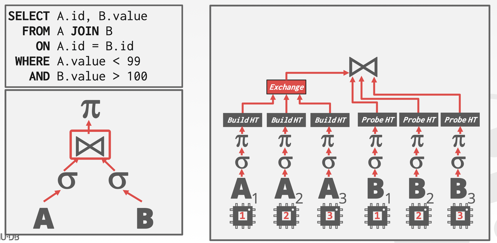  
5. We do the probe side of the B. Same selection and projection at B too. In here, we are just doing reads into our hash table, so those can all execute independently. So they are going to be all emitting tuples independently based on probes into the hash table. 
   
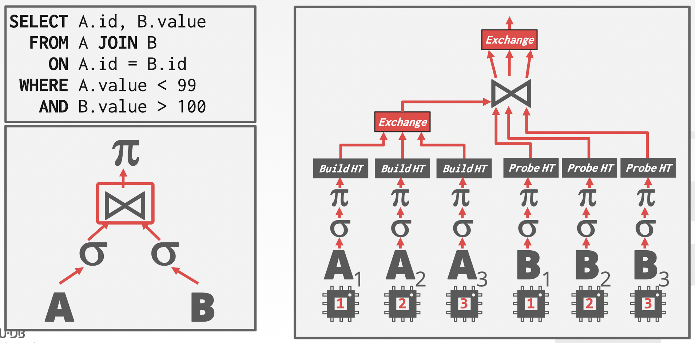   
6. We don't have to worry about combining any results here, we are going to put the exchange operator after the join, it's going to take the three values that are coming out of the probe, so each one of these fragments produces its own output and that's going to get streamed to this exchange operator, it's going to combine them into the final output for the user

### Approach #2: Inter-Operator (Vertical)
- Operations are overlapped in order to pipeline data from one stage to the next without materialization
- Workers execute operators from different segments of a query plan at the same time
- Also called pipeline parallelism

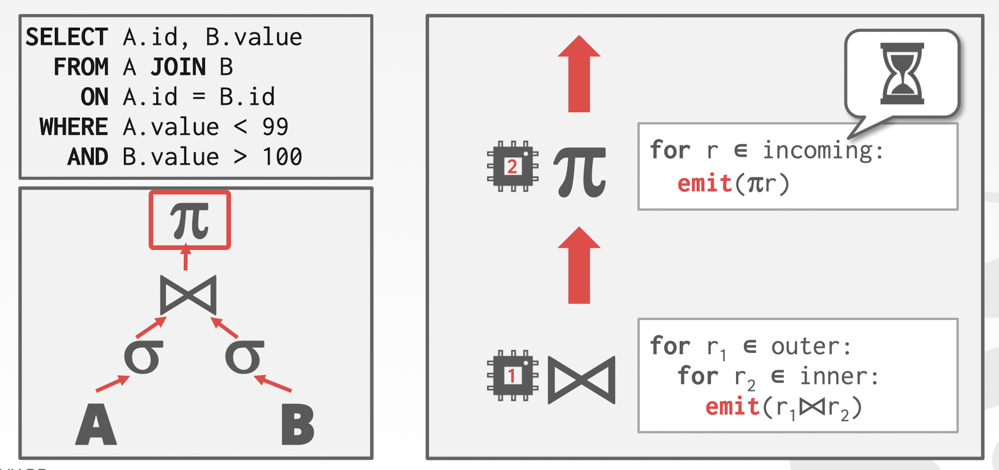   
1. Take the join, and split that up, assign one worker to process the join part
2. We are going to have a separate worker that's just doing the projection. So every time it gets a result from the join operator, it's going to apply the projection and pass out to the result set. 

The challenge here is that since the join operator is a little more complicated than the projection operator, the projection operator might be idle or blocking a lot of the time. We don't necessarily have equal utilization across out parallel workers 

### Approach #3: Bushy
- Hybrid of intra- and inter- operator parallelism where workers execute multiple operators from different segments of a query plan at the same time
- Still need exchange operators to combine intermediate results from segments

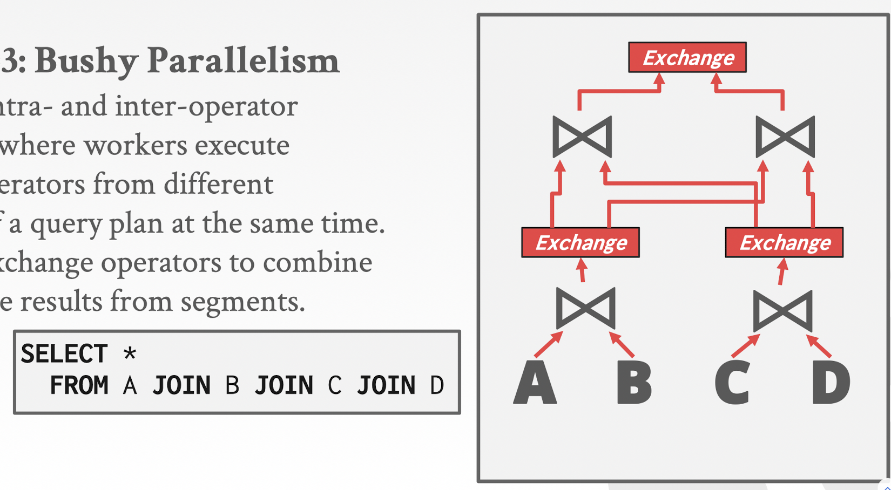  
At this example , we can split it up into using a combination of intra- and inter-query parallelism to get kind of a partitioning like this below. 
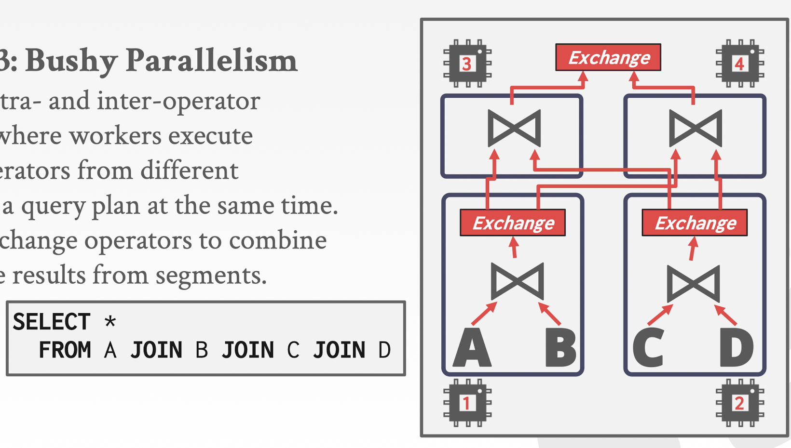   
One worker doing the join between A and B, Another worker doing the join between C and D, and then those can go through the exchange and go to the final join at the end. So we wnat to partition up all of our work into these different groups

### Observation
Using additional processes/ threads to execute queries in parallel won't help if the disk is always the main bottleneck
- If you are doing something really expensive, e.g. exepensive aggregation or join, where a lot of in-memory work going on, then parallel ism can be helpful
- In fact, it can make things workse if each worker is working on different segments of the disk 

# I/O Parallelism
Splitl the DBMS across multiple storage devices
- Multiple Disks per Database
- One Database per Disk
- One Relation per Disk
- Split Relations across Multiple Disks 
  
## Multi-Disk Parallelism
Configure OS/hardware to store the DBMS's files across multiple storage devices
- Storgae Appliances
- RAID Configureation
  - RAID : Redundant Array of Inexpensive / Independent Disks : Data storage virtualization where we have all of these different disks multiple storage devices and they are going to appear as a single logical device  

This is transparent to the DBMS  
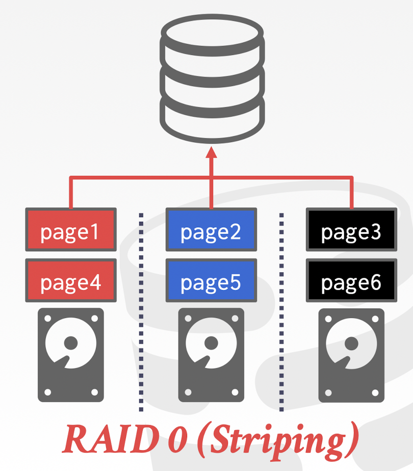   
This is RAID 0 (Striping) 
- Splitting up the pages of the file that we have, page1, page4 go on our first disk, ... 
- Basically taking our pages in our file and transparent to the DBMS partitioning them up across all of these different physical disks
- If you have a file or table that is particularly important (it's hot to the applications, so getting access frequently), and you have the file split up it's pages across multiple disks, you get higher overall bandwidth. There's more bandwidth for us to read in the pages from each of these disks at the same time. Writes will also be better because you can write multip separtists. You will get higher bandwidth both in R/W queries.
- If disk fails or one of our files/pages become corrupted, there's no way to recover it because the file is partitioned in that way
 
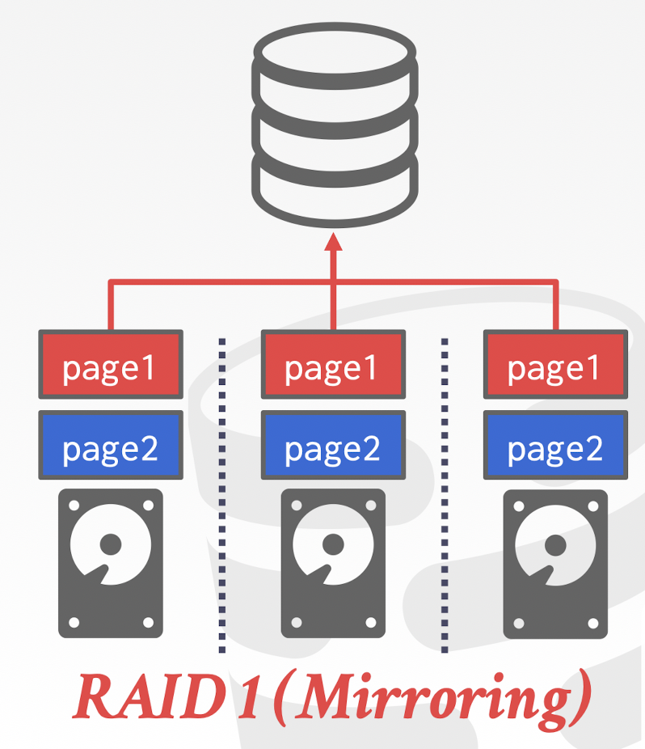   
This is RAID 1 (Mirroring) 
- Duplicate the pages across each of the disks 
- Reads will be good because we are getting more overall bandwidth where we can access from any disk we want, but writes are going to be slower because now we have to replicate it to all of the individual disks
- If disks fails then we are okay still because we have two other disks that have the file replicated 

## Database Partitioning
Some DBMSs allow you to specify the disk location of each individual database
- The buffer pool manager maps a page to a disk location

This is also easy to do at the filesystem level if the DBMS stores each database in a separate directory
- The DBMS recovery log file might still be shared if transactions can update multiple databases

### Partitioning
Split single logical table into disjoint physical segments that are stored/managed separately  
Partitioning should (ideally) be transparent to the application
- The application should only access logical tables and not have to worry about how things are physically stored 

#### Vertical Partitioning
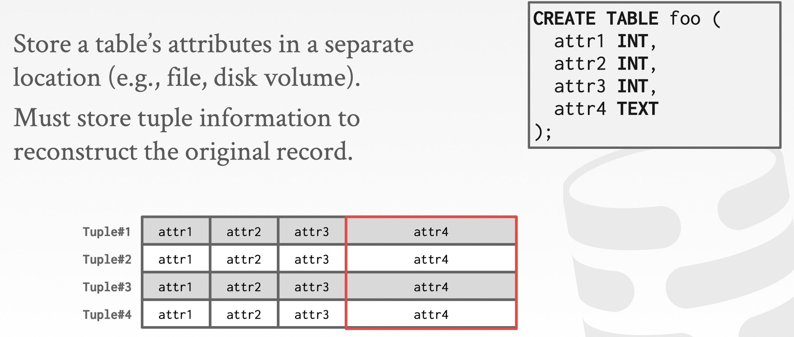   
Example here, attr1,2,3 get read together frequently, and they are INT and easy to store with fixed length, and we have attr4, which is text string data and it's a lot harder to store and it doesn't get accessed as frequently as the other three.  
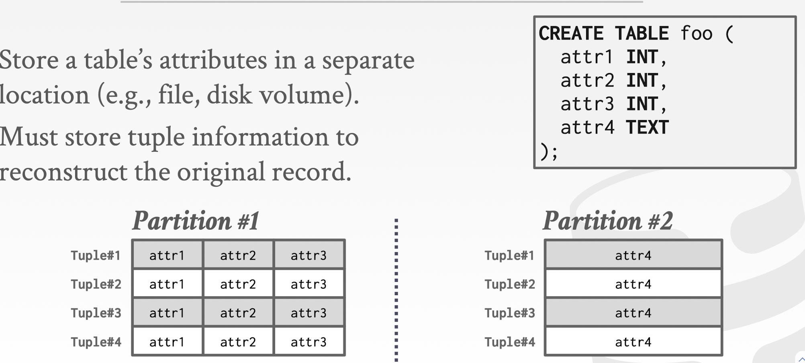  
So what we do is physically split up or partition this table into two separate pieces so we have partition one contains all of the attributes that we access together frequently and partition two contains the text data separately 
Ideally this should all be transparent to the end user with with the application. They don't need to know that the data is physically stored like this. This can be done behind the scenese by the DBMS. 

#### Horizontal Partitioning
Gets done frequently in distributed DBMS, and it also has other advantages for splitting up things in local parallel settings, but basically we're going to divide the table up into these just disjoint segments based on some partitioning strategy. 
We can use like hash partitioning on the keys or the values  
We can use range partitioning  
WE can use predicate partitioning, so if the tuples match some particular predicate or they are in some particular range or something, we can split them all up into disjoint subsets.
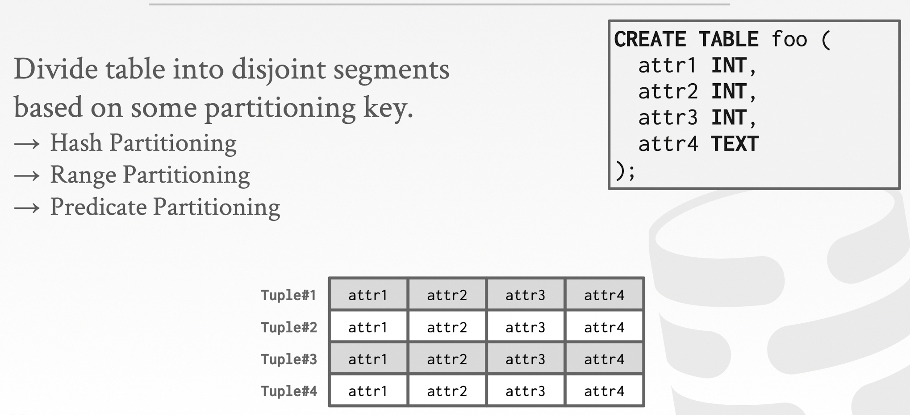   
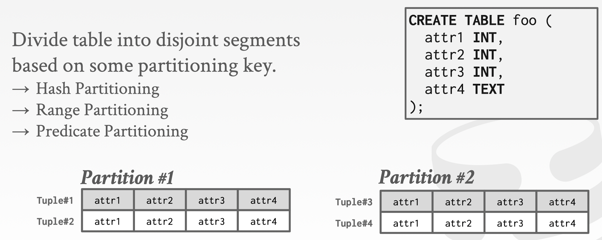  
Here, we did range partioning or sth, we get partition #1 has tuple 1,2 and partition #2 has tuple 3,4. Those are stored separately, but they exist in one logical table.

# Conclusion
Parallel execution is important, which is why (almost) every major DBMS supports it  
However, it is hard to get right
- Coordination Overhead
- Scheduling
- Concurrency Issues
- Resource Contention