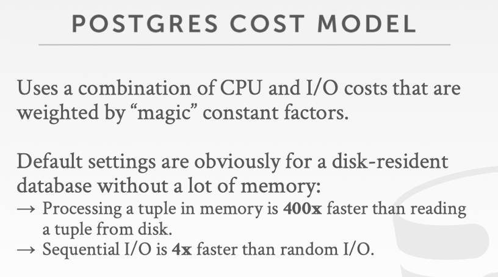

## Notice

This posting is based on Prof. Andy Pavlo's CMU 15.445.645 Intro to Database Systems (Fall 2021) lecture.  
Lecture link : [https://15445.courses.cs.cmu.edu/fall2021/](https://15445.courses.cs.cmu.edu/fall2021/)

  
# Query Optimization
SQL is declarative
- User tells the DBMS what answer they want, not how to get the answer  
<u>There can be a big difference in performance based on plan is used</u> 
<u>Very important problem in database, and still unsolved problem, so there are still a lots of efforts put in this area</u>

## History of Query Optimization - IBM SYSTEM R
First implementation of a query optimizer from the 1970s.
- people argued that the DBMS could never choose a query plan better than what a human could write
Many concepts and design decisions from the System R optimzer are still used today

## Methods

1. Heuristics / Rules
- Rewrite the query to remove stupid / inefficient things
- These techniques may need to examine catalog, but they do not need to examine data
2. Cost-based Search
- Use a model to estimate the cost of executing a plan
- Evaluate multiple quivalent plans for a query and pick the one with the lowest cost

Mature system has both of these mechanisms 

## High-Level Overview
  

1. When SQL Query first arrives at database system, you actually immediately have an option to look at the raw string of the query. It is hard to optimize this part, because there are few information. 
2.  Parse this SQL query 
3. Make an abstract syntax tree
4. Bind this syntax tree with the information in the database system.
Typically, there will be a component in every system called system catalog, essentially that's just metadata about the system. (It stores what's the name of each table, what's the name of each column, column id, table id, etc..)
At this point, you know <u>the semantics of the query</u>. So the result of the binder is called <u>logical plan</u> of the query. And this is <u>the point where we are going to start the optimization</u>.
- Key point : One specific SQL query can have multiple possible valid logical plan. But at this point they just generate a single logical plan that is valid  
Logical plan is the high-level of what this SQL query is trying to do
5. Tree Rewriter / Locial Rewriter : Pretty common in DB, and most DBs have this step to rewrite the logical query plan 
At this point, purely look at the structure of the logical query plan as well as the metadata information in the catalog, we are not looking at the data at all. Apply simple heuristics method to prune down obvious stupid execution choices
6. After logical rewriter, optimized logical plan will be sent to the query optimizer. At here, we use cost-based plan emulation, which will be at the most complicated step. Not only Use system catalog's metatdata, but also a cost model and a statistics look at the data in the system itself(Ex. What would be the distribution of different columns, How many rows in each columns, Number of distinct values)
7. Lastly, it is the physical plan, which sent back to the system to execute

## Logical VS Physical Plans
  
Job of the query optimizer is to generate a physical relational algebra representation that the system can execute in the most efficient manner.  
We have the distinction between logical and physical because at the physical level there are many choices that the system can explore that the search space is so huge. If you are trying to enumerate all those alternatives or physical plans, then the search space would be too big. To solve this, we distinct physical and logical plan. If there are simple rules that we can already apply to eliminate the obvious stupid choice to shrink down the search space as much as possible, then that will help the later on physical enumeration to be much more targeted and much more efficient. 

## Query Optimization is NP-HARD
This is the hardest part of building a DBMS.  
People are starting to look at employing ML to imporve the accuracy and efficacy of optimzers

## Relational Algebra Equivalences
Two relational algebra expressions are <u>equivalent</u> if they <u>generate the same set of tuples</u>  
The DBMS can identify better query plans without a cost model  
This is often called query rewriting

### Predicate Pushdown
The most common example that we will be using  

#### Predicates 
A predicate is an expression that evaluates to TRUE, FALSE, or UNKNOWN. Predicates are used in the search condition of WHERE clauses and HAVING clauses, the join conditions of FROM clauses, and other constructs where a Boolean value is required  

- Reference : [https://learn.microsoft.com/en-us/sql/t-sql/queries/predicates?view=sql-server-ver16](https://learn.microsoft.com/en-us/sql/t-sql/queries/predicates?view=sql-server-ver16)  

  
When we make this execution, then we can draw the relational algebra expression like this below.  
  
This logical query plan is what would show up immediately after the binder step. Even after binder step, <u>there could be a multiple valid alternatives for the logical query plan</u>. We are only going to <u>pick one logical query plan that is convenient. And then we are going to start our optimization from there</u>.  
  
One obvious thing we could optimize is that we can <u>push this predicate</u> which is going to filter the grades based on the grade level A, before we execute the join. Then <u>the number of tuples that we need to feed into the join operation would be much less. So join can be much more efficient</u>.  
  
Reiterate the concept of relation algebra equivalence, two expressions that we considered now will generate the same set of tuples  

### What if they have multiple filters ? 
 
  
For a set of predicates, we are going to <u>break it down to individual predicates</u>. And then push individual predicates down to the <u>position that is closest to where you access the table</u>.   
There could be also some simplifications you can do by just looking at these predicates.  
For example, if you have predicates $X=Y AND Y=3$, you can use linear algebra rules to rewrite this predicate to be $X=3 AND Y=3$.  
This is pretty naive, but this could be useful  
For example, let's assume that X and Y came from different tables. If you have the predicate in the first way, you can only push down one predicate($Y=3$). But in the second case, you can push two predicates($X=3, Y=3$)  
  
With the relational algebra equivalence, you can also do a more complex things like rewrite the join orders using the rules like commutativity and associativity.  
But at high level with those rules, you can actually generate lots of different alternatives.  
For example, with this join enumeration rules like commutativity and associativity rules, <u>the number of possible drawing orderings that you can generate for your n-way join is approximately Catalan Number</u>, which is extremely large. At this stage, you <u>can't really use the simple heuristics on other simple rules to find the better alternatives.</u> So essentially for a more complex traditional algebra equivalences like this, we are <u>not going to consider that in the first type optimization using rules or heuristics</u>. This is what we are going to discuss in the <u>second type of optimization with the cost model and a more principal search mechanism</u>.  
  
Can also do the early projections with the relational algebra equivalences. this could be done in the logical rewriting phase where we do not need the cost model yet.  
This is mostly <u>useful for the row stores comparing to column stores</u>. What this does is that if you have a final projection, for example, in the above example we are only looking at the id and name of records in table, so we don't have to select everything. <u>When we are trying to access the data, we can already only looking at the record or the columns of the eventual projection that we need instead of reading everything out</u>.   
Quick Example 
  
In the left, at final step, we only care about the name of the students as well as the id.  
<u>Instead of selecting every column from student and enrolled</u>, we just <u>do this projection earlier</u>. 

###  We talk about different ways that we can rewrite these queries based on the logical query plan, and the important thing that <u>we did here is that with this simple rules, we reduce the search space that the later physical query plan enumeration will need to search over</u>

## Logical Query Optimization 
- Transform a logical plan into an equivalent logical plan using pattern matching rules
- The goal is to increase the likelihood of enumerating the optimal plan in the search
- Cannot compare plans because there is no cost model but can "direct" a transformation to a preferred side

### Split Conjuctive Predicates

If a query that have a predicate with multiple filters, then we can decompose the multiple filters into the predicate so that we can have more opportunities for optimization.   

Example  
  
This is a three-way join, join artist, appears, and album, and we have a complicated predicate.  
If we just have a naive logical query plan generated after binder at this point, then this predicate is pretty big, so it's difficiult to optimize.  
  
So what we do is split this predicate to separte filters.  
After that, we are going to look at each filter individually. We are trying to move these filters to the lowest point possible in this query plan.  
Why?
- The lower this predicate are then the earlier that we can filter out unncessary tuples in this query processing so that our overall query processing overhead would be lower. 

So we look at these predicates, and push down these predicates to corresponding places.  
  
What would this enable us ? 
- Not only this filter moves closer to the access, but also we can replace a naive join operation
 

  
So instead of having a cartesian product and then filter out the tuples later, we just directly combine the join with predicates. So this can be executed as a inner join which will be much more efficient than a naive cartesian product.  

  
There will be another optimization, earlier projection, where you just look at the columns you are eventually going to read or return with the results, and push these projections to the lowest possible point in the query plan. So that you don't need to read all these columns in the table from the beginning to the end. 

## Nested Sub-Queries
The DBMS treats nested sub-queries in the where clause as functions that take parameters and return a single value or set of values  

Two Approaches to accelerate this process: 
- Rewrite to de-correlate and/ or flatten them
  - Rewrite inner query, so that you can combine this inner query with the outer query together, so there is no nesting anymore, which is called flattened. 
- Decompose nested query and store result to temporary table

### Nested Sub-Queries - Rewrite
  
In this example, there is join in the inner query referencing column in the outer query.  
So instead of writing this as a sub-query, what we can do is that we can just look at these two tables together and then we can have an inner join to join these two tables on this id and to figure out that whether there will be a matching records on that specific date.  

Benefits :
- In the first case, you have to re-execute this inner query for each individual query from the outer table. Let's say that sailors table has a bilion records. Then for each individual sailor, you have to execute the where clause in the inner query once, which is very inefficient. For the second case, it is more efficient. 
 

### Nested Sub-Queries - Decompose
  
For this inner query, trying to figure out the max rating among all the sailors in the table. This inner query is not referencing any information from the outer query. It can be executed by itself. Instead of for each join operation outside executing this maximum of inner query over and over again, we can pull this inner query out and then execute this inner query ahead of time once and store the result in a temporary table and then when we finally execute the outer query, you can just replace the result. So we don't need to have a duplicated execution of this inner query.  

#### General Rules
- For harder queries, the optimzer breaks up queries into blocks and then concentrates on one block at a time.
- Sub-queries are written to a temporary table that are discarded after the query finishes. 

  
Take a look at this Nested Block.  
  
Lift this Nested Block to be a separate query.  
  
And then we execute and replace the values. 

## Expression Rewriting
An optimizer transforms a query's expressions (e.g., WHERE clause predicates) into the optimal/minimal set of expressions  
Implemented using if/then/else clauses or a pattern-matching rule engine
- Search for expressions that match a pattern
- When a match is found, rewrite the expression
- Halt if there are no more rules that match

 
Examples  
  
1 = 0 is impossible. Just not execute this  
  
1 = 1 is always true. Just remove this predicate  
  
 

  
Join two tables that are same   
  
  
  
Inner query is self-join. Pull this query out.  
   

  
OVerlap between first and second filter. We can combine this.  
   

# Cost-Based Query Planning
Generate an estimate of the cost of executing a particular query plan for the current state of the database
- <u>Estimates are only meaningful internally</u>
  - We can compare some query plans in PostgreSQL by specific cost model, but it does not make sense if you compare query plan in PostgreSQL with query plan in MySQL by specific cost model. 
- This is independent of the plan enumeration step
  - For in one single system, there could be a different alternatives of cost models. There could be a simple cost model which is very easy to apply and very efficient to compute, and there could also be a complicated cost models, which is accurate but takes more overhead

## Cost Model Components
  
- Physical cost estimation will typically only seen in a commercial or enterprise db systems. Most of open-source db systems, such as PostgreSQL or MySQL, you are not going to see this kin of physical cost because this is much more related to hardware
- Only one thing that most open source db system would consider is the cost that you distinguish between random vs sequential IO. Because for disk-based system that matters a lot. 
- In the logical costs, you only consider the logical intermediate computation that you would need in your query plan. Similar to definition of relational algebra equivalence. For the logical costs, it's only going to look at the size of the input and output of each when you execute that query. 
- <u>Logical costs and Algorithmic costs are what mostly used in open source systems. </u>

### Disk-Based DBMS Cost Model
The number of disk accesses will always dominate the execution time of a query
- CPU costs are negligible
- Must consider sequential vs. random I/O 
 
This is easier to model if the DBMS has full control over buffer management
- We will know the replacement strategy, pinning, and assume exclusive access to disk

#### Open-Source Cost Model
   
- Postgres cost model assumes that the system does not have a large amount of memory, so the most of the operations performed onto the disk

#### Enterprise Cost Model
   

# Conclusion

- We can use static rulse and heuristics to optimize a query plan without needing to understand the contents of the database
- We use cost model to help perform more advanced query optimizations

  

