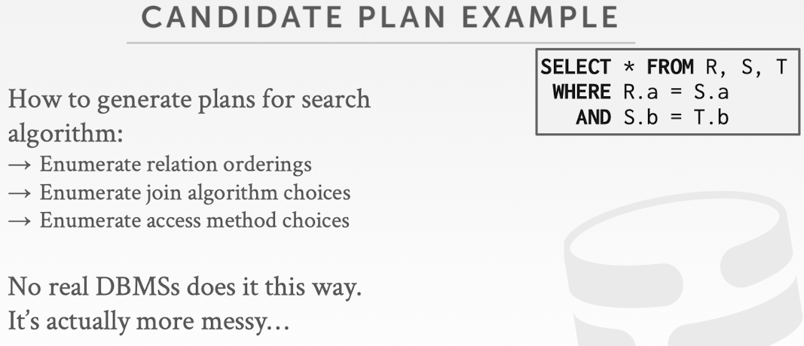

## Notice

This posting is based on Prof. Andy Pavlo's CMU 15.445.645 Intro to Database Systems (Fall 2021) lecture.  
Lecture link : [https://15445.courses.cs.cmu.edu/fall2021/](https://15445.courses.cs.cmu.edu/fall2021/)

  
# Logical Costs

At logical costs, we are going to primarily rely on something called the statistics inside the database

## Statistics
- The DBMS stores internal statistics about tables, attributes, and indexes in its internal catalog
- Different systems update them at different times

Because database have a lot of tables, it would often take time to be costly to compute those statistics. So what database system typically do is that <u>instead of calculating the statistics while or before you execute a query, your database system would have special commands that you can execute to calcuate the statistics for all the tables and attributes ahead of time and then store them in its internal tables</u>. Command itself could be different among different systems like below.  
   
Most of the time that actually required from the users or DBA to issue this command to the database system at the best time that the users or developers deem to be suitable.  
But in some cases, the system may automatically generate the statistics when the system workload volume is low. EX) ORACLE  
Postgres may actually piggyback on other background maintenance tasks to generate statistics without you notify them. 

### Two Most Basic Statistics
  

- Number of tuples : 
  - need this to estimate the cost of a sequential scan 
- Number of distinct values : 
  - if your query has a select distinct, then the number of distinct values will directly tell you what's the output size
  - Also be useful in the case that you have a hash-join operation. Then you want to know what we possibly be the size of the hash table

### Derivable Statistics
    

The primary goal of these statistics is to help calculate the logical cost in our database system so that we can eventually do a cost estimation   
  
In the above example, equality predicate on the primary key does not need those statistics, because primary key is unique.  
But in most other cases, let's say we have a range query or more predicates, then statistics can help you decide how many tuples you are going to get in each operator.   

### Complex Predicates
Selectivity : The fraction of tuples we are going to get after each operator  
   

Example  
   
   
  
Observation : 
  - The way we call selectivity is essentially similar to what we learned from probability  
    -> We can borrow simliar concepts from statistics or probabilistic theory that help us calculate these activities, especially with the more complicated practical predicates. 

   
   

### Result Size Estimation for Joins
  
In actuality, in many cases this would actually hold and especially when you are joining two tables and then there will be a foreign key constraint on one table towards the other, and if that's the case this assumption would actually be satisfied. But in many other cases, it won't  

   
Assumption : We are joining a relation R and S, and have only one join predicate. Also join predicate is not a primary key column because otherwise it will be much easier because every primary key is unique and in that case it's a straightforward to know what would be the maximum size that is possible  

## Selection Cardinality
Assumptions : 
1. Uniform Data
  - The distribution of values (except for the heavy hitters) is the same
2. Independent Predicates 
  - The predicates on attributes are independent
3. Inclusion Principle
  - The domain of join keys overlap such that each key in the inner relation will also exist in the outer table

So now I will talk about the <u>optimizations that the assumptions that are made can break</u>. 
### Assumption Break 1 : Correlated Attributes 
One case that independent assumption is broken.  
   
Potential ways to fix this?    
->  Define correlated column statistics on multiple attributes in a database

### Assumption Break 2 : Cost Estimations
   
 What we assume was like above, data are uniform. In this case, our selection cardinality estimation would be a perfect.  

  
But in real, it's non-uniform.  
Naive thing we can do is instead of recording the total number of distinct value, record the occurrence of each single value. But the obvious problem is that this can become pretty large.  

We can do bit more smarter thing instead of recording all the occurrence. It is that we can <u>track the occurrence of multiple values together to amortize the cost</u>. The data structure that to track these values will be called <u>histogram</u>. 
### Equi-Width Historgram
  
In this example, we are going to track the occurrence of every three values together. Groups of values are called bucket.  
  
This is less costly, but less accuracy.  
So here, you can do the optimization. Instead of divide this total amount of values into buckets by the number of values, we can <u> group these values based on the number of occurrences </u> 

### Equi-Depth Histogram
  
Trying to divide these into buckets such that the toal number of occurrences in each bucket will be almost the same values  
  

Next two techniques are less common, but some people would use it if that's suitable for their goal. 
### Sketches
This is simliar to Bloom Filter.  
Probabilistic data structures that generate approximate statistics about a data set.  
Cost-model can replace historgarms with sketches to improve its selectivity estimate accuracy  

Most common examples :
- Count-Min Sketch : Approximate frequency count of elements in a set
- HyperLogLog : Approximate the number of distinct elements in a set

### Sampling
Modern DBMSs also collect samples from tables to estimate selectivities  
Update samples when the underlying tables changes significantly  
When a query comes, just look at the samples in my data set, and then extrapolate from there  
  
Overheads 
- need to keep it somewhere as a temporary table
- need to execute mini query in the temporary table, so can be more costly

# Query Optimization
After performing rule-based rewriting, the DBMS will enumerate different plans for the query and estimate their costs
- Single relation
  - Straightforward, can still use heuristics to generate alternative query pland and cost plan without complicated search
- Multiple relations
  - queries with joins involved whether it's a two-way or three-way or multi or more way of joins  
  - Typically need a more involved search mechanism or principal assessment mechanism to help us compare alternatives, because the number of possible alternative will just be a too big if you do it naively
- Nested sub-queries
  - First look at whether we can expand the nested queries to unload it or flatten it to a join and then treat it the same way as the Multi relations / try as possible to lift it up to a separate query then we don't need to consider the nested queries together either

It chooses the best plan it has seen for the query after exhausting all plans or some timeout 

## Single - Relation Query Planning
Not very complex. Just use simple rules or heuristics to generate alternative query plans as well. But we are still going to use our cost model and then compare the cost of alternatives instead of directly rewrite a query plan  
Pick the best access method 
- Sequential Scan
- Binary Search (clustered indexes)
- Index Scan  

Predicate evaluation ordering
- predicate with multiple clauses, then play with order of different predicates  

Simple heuristics are often good enough for this  
OLTP queries are especially easy
- Where you just insert a tuple into your table
- Just look at a specific record or update it instead of complex analytical query that involve multiple relations

### OLTP Query Planning
  
Like the example, they just use the primary index to execute this query  

## Multi - Relation Query Planning
Most challenging thing : What the <u>join order</u> should be  
As number of joins increases, number of alternative plan grows rapidly  
-> <u>we first need to restrict search space</u>  
Fundamental decision in System R : only left-deep join trees are considered to reduce the search space, they do not consider right-deep join trees or bushy tree  
-> Modern DBMSs do not always make this assumption anymore  
  
Intuition from this :  
Left-deep join trees allow much easier to pipeline plans where intermediate results are not written to temp files 
- While you are executing this query with a multi-way join, you actually <u>don't need to materialize you join result in a temporary table or write that back to the disk during the join</u>. Because every time we have a join, the temporary result coming out of a join operation will just be immediately joined with another table compared to others. This matters more back in the day because the system don't usually have a large amount of memory. If the temporary join result is big, then you need to write that back to the disk to save it, and perform other join. So it takes much more time. <u>Currently, it is not a big concern, but if you have a small memory, left-deep join is good choice</u>
- Not all left-deep trees are fully pipelined  

### How to think of alternatives? 
  

### Dynamic Programming
  
Since we use dynamic programming, we can elimate less optimal choices   
   
   
   
   

### Candiate Plans
   
    
There are different possiblity of the ordering of these relations. In system R, eliminated the one beginning from right.  
    
A lot of different join algorithms.  
   
 For each join order, also need to choose access pattern. 

 ### Postgres Optimizer
    

 #### Example
     
 Start with few randomly picked join algorithms. Estimate costs.    
    
 And Record the best plan and remove the worst cost plans. In addition, pick the elements from the query plan trees of the better plans 
     
 Do the randomized combination of those elemetns as well to generate second batch. Estimate the cost.  
     
 Record the best plan and throw away the worst plans. And then pick elements from better plans.  
     
 Perform the third one and so one until the planning time budget is exhausted. 

 ### Mimicking evolution process
 - every batach, bad genes (bad plans) will be thrown away, and record best or better genes so far

 # Conclusion
 - Filter early as possible 
 - Selectivity estimations 
    - Uniformity 
    - Independence 
    - Inclusion 
    - Histograms 
    - Join selectivity 
- Dynamic programming for join orderings 
- Again, query optimization is hard

