## Notice

This posting is based on Prof. Andy Pavlo's CMU 15.445.645 Intro to Database Systems (Fall 2021) lecture.  
Lecture link : [https://15445.courses.cs.cmu.edu/fall2021/](https://15445.courses.cs.cmu.edu/fall2021/)

  

## Database Storage
- Spatial Control
  - Where to write pages on disk
  The goal is to keep pages that are used together often as physically close together as possible on disk
- Temporal Control
  - When to read pages into memory, and when to write them to disk
  - The goal is to minimize the number of stalls from having to read data from disk
    - If there is a page that you need currenly doesn't reside in your memory, your query application will be blocked while the DBMS goes and read from disks (I/O stalls)
  
## Access Times
  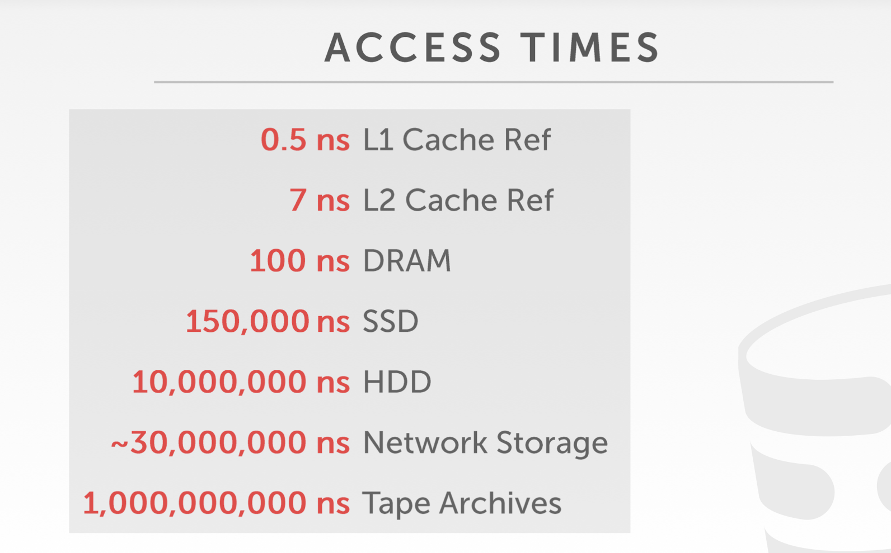  
  DBMS engineer needs to figure out efficient way to maintain this buffer pool to keep things in memory as much as possible

## High-level Buffer Pool Process : Disk-Oriented DBMS

  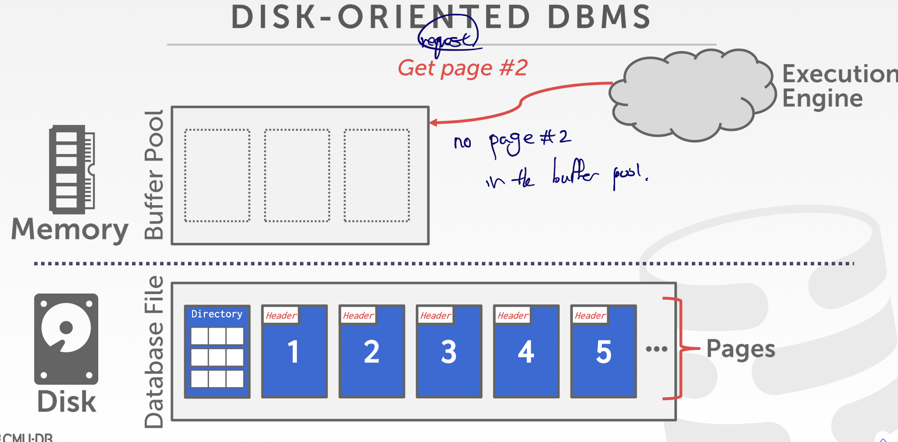  
  Directory stores page id and mapping information.  
  Execution engine request to get page #2.  
   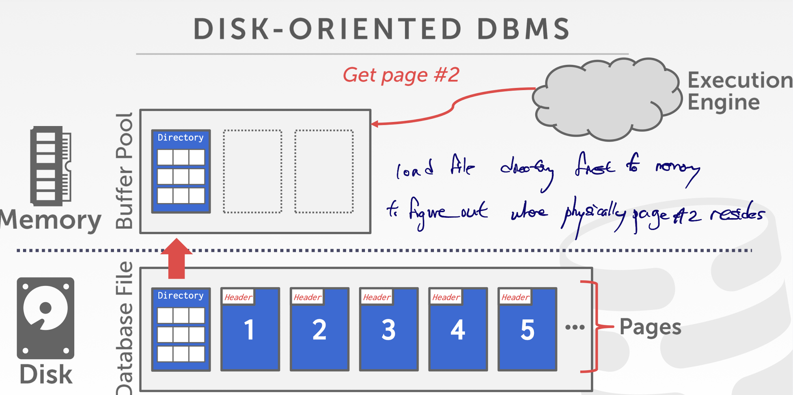  
  Since there is no page #2 in the buffer poool, we need to load file directory first to memory to figure out where physically page #2 resides.  
   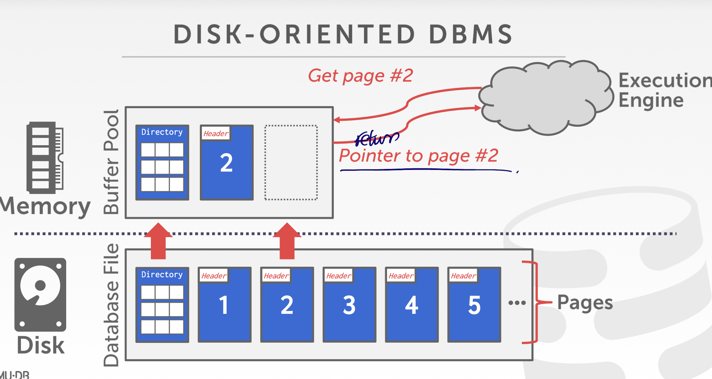  
   And fetch page #2 and return it to the execution engine. 

## Buffer Pool Organization
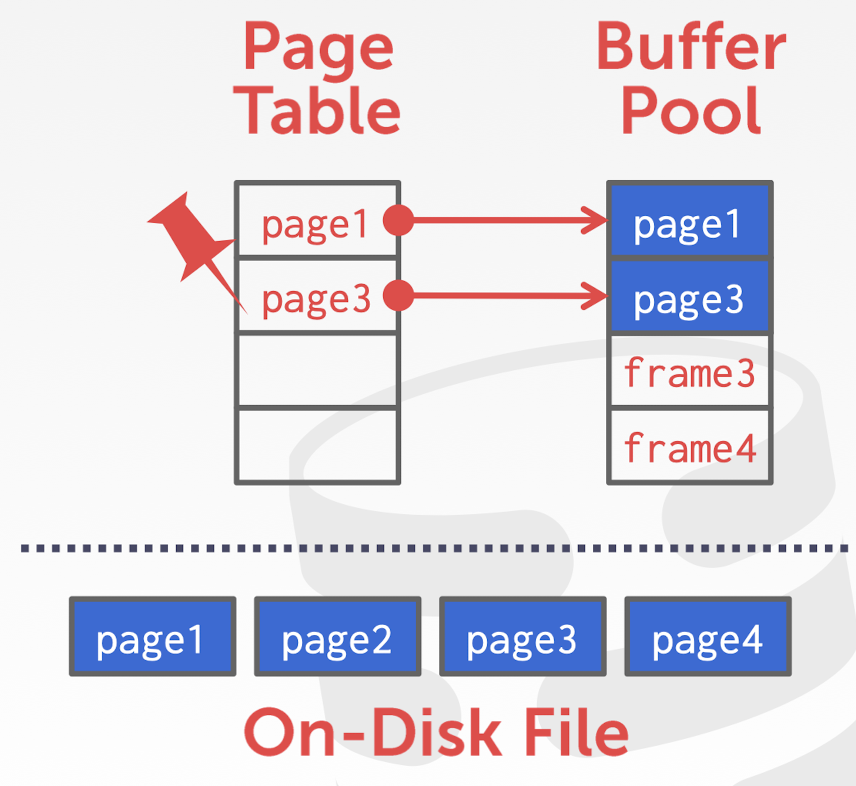  
It is the memory region organized as an array of fixed-size pages. An array entry is called a frame.  
When DBMS requests a page, an exact copy is placed into one of these frames.  
The page table keeps track of pages that are currently in memory.  
It also maintains additional meta-data per page :
- Dirty Flag 
  - Boolean Value. Whether or not page has been modified since it was loaded in to memory
- Pin/Reference Counter
  - if we want a particular page in buffer pool, not want it to be evicted, keep track of counter

## Locks VS Latches

Locks : 
- Protects the database's logical contents from other transactions
- Held for transaction duration
- Need to be able to rollback changes
 
Latches : 
- Protects the critical sections of the DBMS's internal data structure from other threads
- Held for operation duration
- Do not need to be able to rollback changes
- Mutex (Mutual Exclusion) : shared area that different processes or threads should not access in the same time

## Page Table VS Page Directory

Page Table : 
- is the mapping from page ids to a copy of the page in buffer pool frames
- is an in-memory data structure that does not need to be stored on disk

Page Directory : 
- is the mapping from page ids to page locations in the database files
- All changes must be recorded on disk to allow the DBMS to find on restart

# Buffer Pool Optimizations
- Multiple Buffer Pools
- Pre-Fetching
- Scan Sharing
- Buffer Pool Bypass

## Multiple Buffer Pools
The DBMS does not always have a single buffer pool for the entire system
- Multiple buffer pool instances
- Per-database buffer pool
- Per-page type buffer pool
- Advantages : Helps reduce latch contention and imporve locality and can specialize buffer pools for needs of individuals

### Approaches 
- 1 : Object Id 
  - Embed an object identifier in record ids and then maintain a mapping from objects to specific buffer pools
- 2 : Hashing
  - Hash the page id to select which buffer pool to access

## Pre-Fetching
The DBMS can also prefetch pages based on a query plan
- Sequential Scans
- Index Scans 

### Sequential Scan
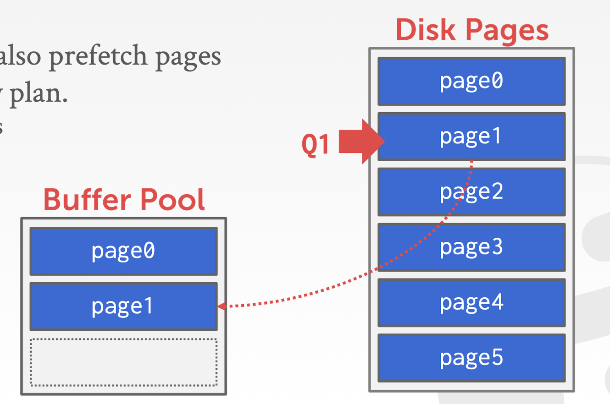  
Q1 will access page 2&3 next. So allow DBMS to map these pages ahead of time so that we do not need to wait them to be mapped.  
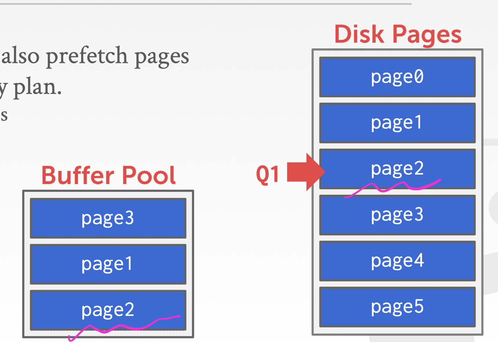  

### Index Scan
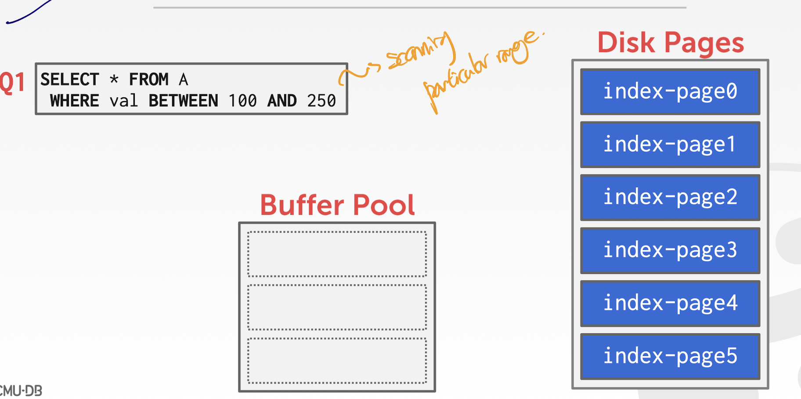  
From root, descend the tree where we are interested in.  
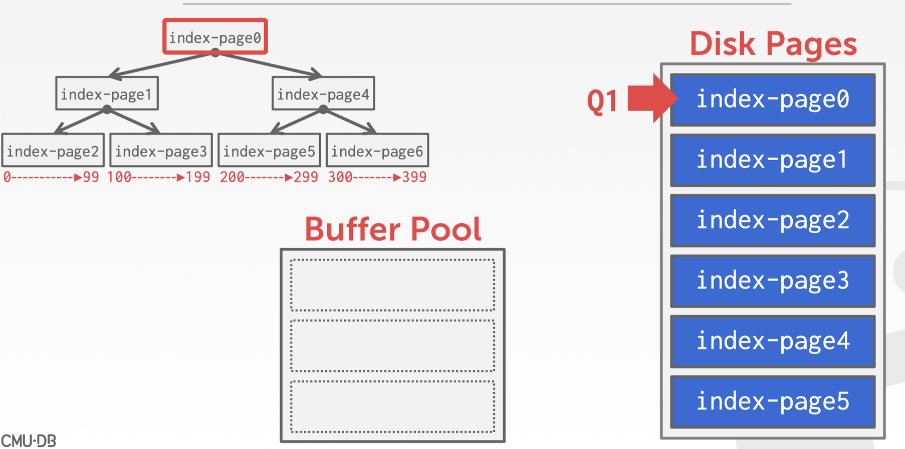  
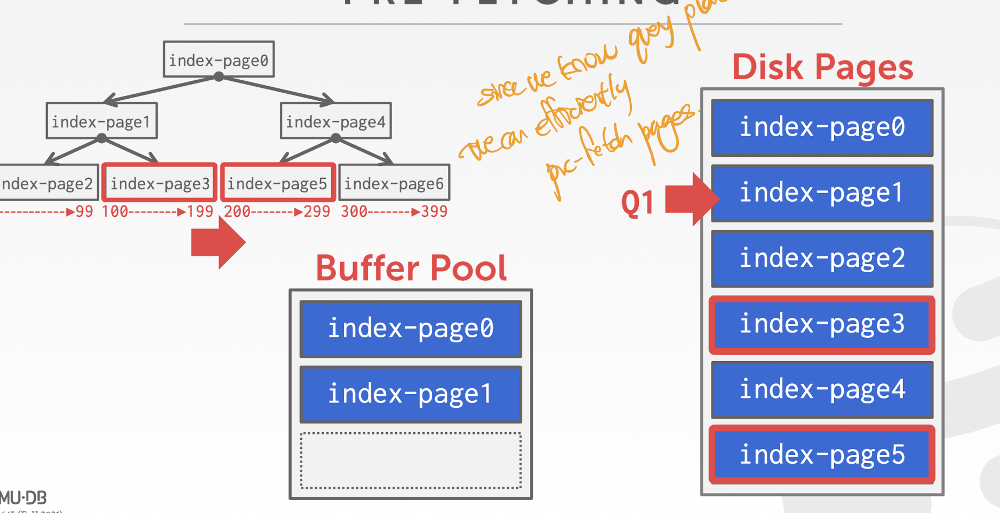  
Since we know query plan, we can efficiently pre-fetch pages.  

## Scan Sharing
Queries can reuse data retrieved from storage or operator computations by other queries
- Also called synchronized scans
- This is different from result caching  
Allow multiple queries to attach to a single cursor that scans a table 
- Queries do not have to be the same
- Can also share intermediate results  

If a query wants to scan a table and another query is already doint this, then the DBMS will attach the second query's cursor to the existing cursor  

### Examples
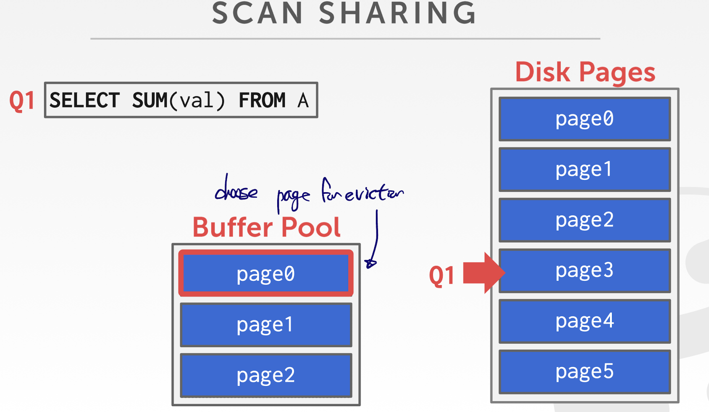  
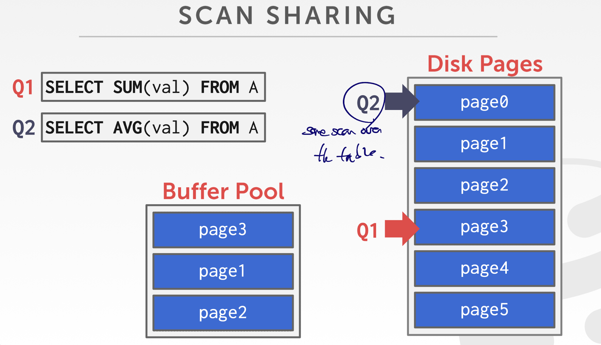  
If the Q2 scan from the page 0, it needs page0 which was evicted. So do as below.  
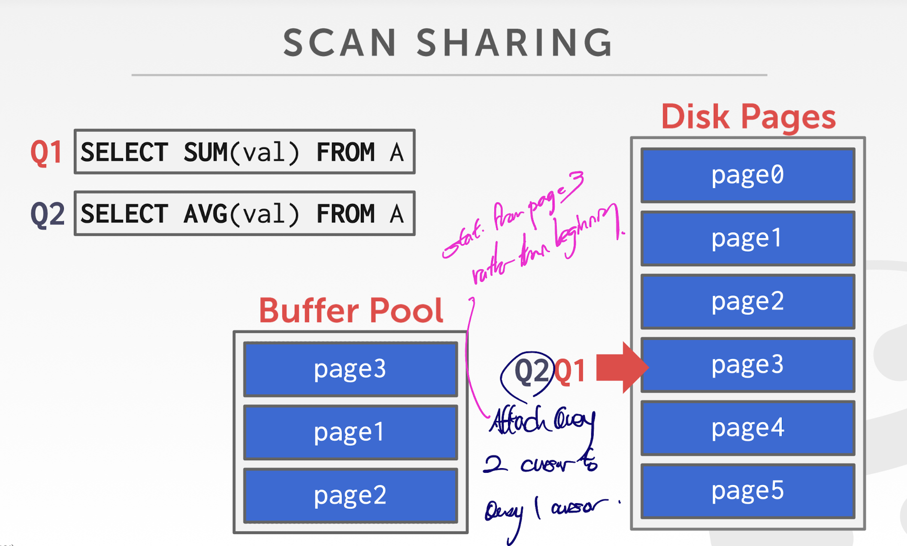  

## Buffer Pool Bypass
The sequential scan operator will not store fetched pages in the buffer pool to avoid overhead
- Memory is local to running query
- Works well if operator needs to read a large sequence of pages that are contiguous on disk
- Can also be used for temporary data (sorting, joins)

## OS Page Cache
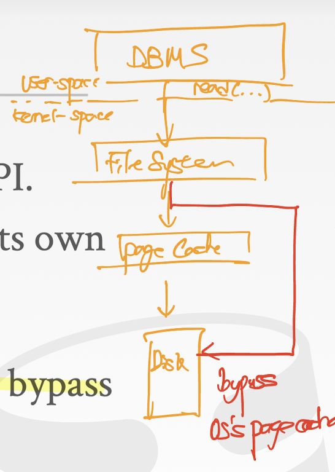  
Most disk operations go through the OS API.  
Unless you tell it not to, the OS maintains its own filesystem cache (i.e. the page cache).  
Most DBMSs use direct I/O (O_DIRECT) to bypass the OS's page cache
- Redundant copies of pages
- Different eviction policies
- Loss of control over file I/O

## Buffer Replacement Policies (Eviction Algorithm)
When the DBMS needs to free up a frame to make room for a new page, it must decide which page to evict from the bufer pool  
Goals : 
- Correctness
- Accuracy
- Speed
- Meta-data overhead

### Least-Recently Used
Maintain a single timestamp of when each page was last accessed  
When the DBMS needs to evict a page, select the one with the oldest timestamp
- Keep the pages in sorted order to reduce the search time on eviction

### CLOCK
Approximation of LRU that does not need a separate timestamp per page
- Each page has a reference bit
- When a page is accessed, set to 1
 
Organize the pages in a circular buffer with a "clock hand":
- Upon sweeping, check if a page's bit is set to 1
- If yes, set to zero. If no, then evict

### Problems 
LRU and CLOCK replacement policies are susceptible to sequential flooding : good for skewed access patter, bad for sequential scan
- A query performs a sequential scan that reads every page
- This pollutes the buffer pool with pages that are read once and then never again
 
In some workloads the most recently used page is the most unneeded page  

### Better Policies 
#### LRU-K
Track the history of last K references to each page as timestamps and compute the interval between subsequent accesses  
The DBMS then uses this history to estimate the next time that page is going to be accessed.  

#### Localization 
The DBMS chooses which pages to evict on a per txn/query basis. This minimizes the pollution of the buffer pool from each query
- Keep track of the pages that a query has accessed  
EX) Postgres maintains a small ring buffer that is private to the query

#### Priority Hints
The DBMS knows about the context of each page during query execution  
It can provide hints to the buffer pool on whether a page is important or not

### Dirty Pages 
- Fast : If a page in the buffer pool is not dirty, then the DBMS can simply drop it
- Slow : If a page is dirty, then the DBMS must write back to disk to ensure that its changes are persisted  
Trade-off between fast evictions versus dirty writing pages that will not be read again in the future

### Background Writing 
The DBMS can periodically walk through the page table and write dirty pages to disk  
When a dirty page is safely written, the DBMS can either evict the page or just unset the dirty flag  
Need to be careful that we don't write dirty pages before their log records have been written

### Conclusions
The DBMS can almost always manage memory better than the OS  
Leverage the semantics about the query plan to make better decisions : 
- Evictions
- Allocations
- Pre-fetching