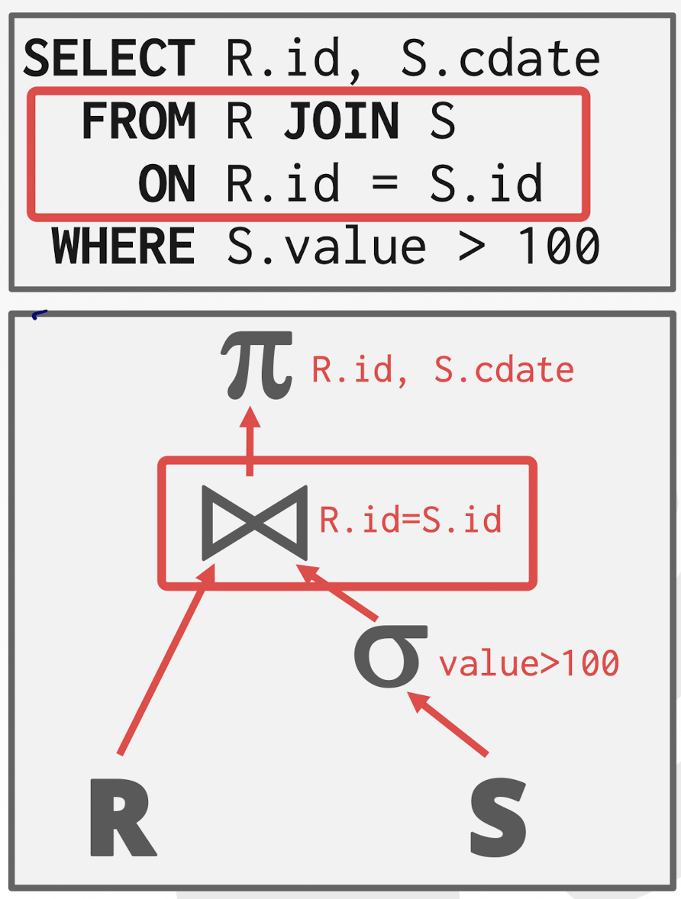
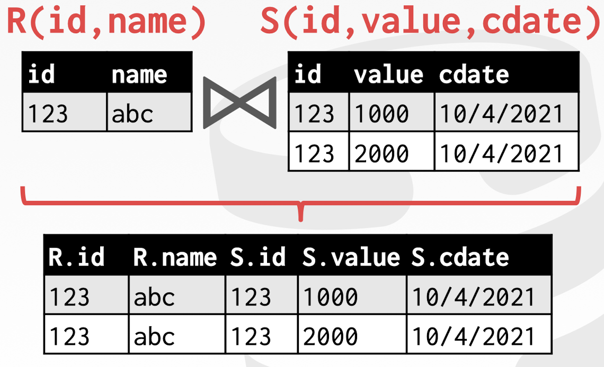
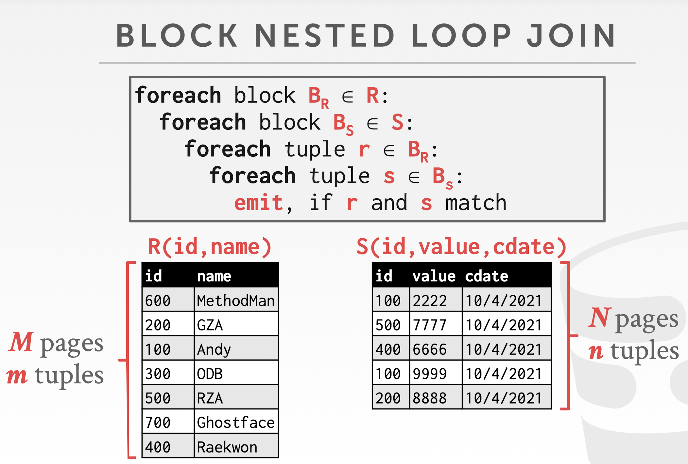
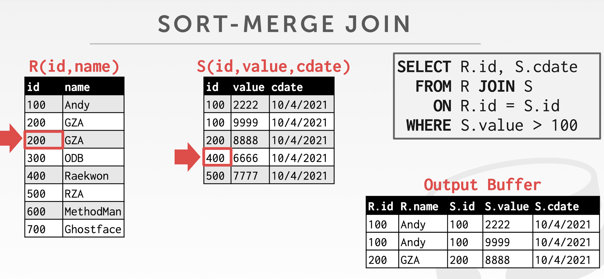

## Notice

This posting is based on Prof. Andy Pavlo's CMU 15.445.645 Intro to Database Systems (Fall 2021) lecture.  
Lecture link : [https://15445.courses.cs.cmu.edu/fall2021/](https://15445.courses.cs.cmu.edu/fall2021/)

  
## Why do we need to join? 

- We want to <u>normalize tables in a relational database to avoid unnecessary repetition of information</u>. 
- We then use the <b>join operator</b> to <u>reconstruct the original tuples without any information loss</u>.
- Almost every NOSQL has some for of join support
- e.g. in OLAP : spent 80% into JOIN

# Assumption
focus on performing <b>binary joins(two tables) using inner equijoin</b> algorithms.
- These techniquies can be <u>generalized to support other joins</u>.
- <u>Multi-way joins</u> exist primarily in research literature, <u>not practical in real-world systems</u>.

<b>We want the smaller table to always be the left table("outer table") in the query plan.</b>  

# Join operators
 

 
Two decisions exist  
  1. Output  
    - What data does the <u>join operator emit to its parent operator in the query plan tree</u>?  
  2. Cost Anlysis Criteria  
    - How do we <u>determine whether one join algorithm is better than another</u>?   

# Join operators - 1. operator output
For tuple $r \in R$ and tuple $s \in S$ that match on join attributes, concatenate $r$ and $s$ together into a new tuple. 
 

 
Output contents can vary:
- Depends on processing model
  - One tuple at a time
  - Returning several(like vector) of tuples / an array of tuples
- Depends on storage model
  - Row store : get all of the tuple values once
  - Column store : uses early / late materialization
- Depends on data requirements in query
  - In this case, we only need two columns in the final projection. We could apply some early filtering of attributes, called projection push down so that we could apply our projection ealier on in the query plan

## Early Materialization : 
-> Copy the values for the attributes in outer and inner tuples into a new output tuple
 
 
Below is how it works  

 
Take the values from the outer relation, which is R : left-had side and inner relation, which is S, and merge them together into one contiguous tuple for each match
 

 
Passed this intermediate result from join operator to the projection operator 
 

Advantages : 
- According to the above figure, subsequent operator(in this example : projection) no need to go back and fetch the columns that you needed

All intermediate results that needs to be materialized are stored at buffer pool

## Late Materialization :
-> Only copy the joins keys along with the Record IDs of the matching tuples
 
 
Below is how it works  

 
Produce the keys as well as the record ids for each of those tuples 
 

 
Then we can go back in the projection stage, look up what are the values that we need (in this example : it is cdate value)
 
Advantages : 
- Ideal for column stores because the DBMS does not copy data that is not needed for the query

# Join operators - 2. cost analysis criteria

## Assumption
- $M$ pages in table $R$, $m$ tuples in $R$
- $N$ pages in table $S$, $n$ tuples in $S$
- Cost Metric: # of IOs to computer join
- We will ignore output costs since that depends on the data and we cannot compute that yet

## Join VS Cross-product
- R $\Join$ S is the most common operation and thus must be carefully optimized  
- R X S followed by a selection is inefficient because the cross-product is large

<u>Conceptually</u>, it is useful to think of Joins as a cross product or cartesian product, where you get all of the pairwise combinations of tuples and then apply a selection after filter out the ones that don't match.  
But, <u>from a performance standpoint, you would never actually want to do that. </u>Because if you do that, you will get $N^2$ operation.  
Really, what we want to do is <u>direct join where we find in as little work as possible all the direct matches </u>so we don't have to materialize the full cross product or cartesian product and fitler it. 

<b>There are many algorithms for reducing join cost, but no algorithm works well in all scenarios.</b>

# Join algorithms - 1. Nested Loop Join

 
Named nested loop, because there are two loops. One loop for outer, left-hand sided, the other one for inner, right-hand sided relation.   

<b>Why bad?</b> 

 
Examples  

 
It is still slow, but at here, <u>just by making one simple switch, we can speed up. </u>

## Block Nested Loop Join

 
Rather than perfoming full scan in the inner relation, we are going to break it up into blocks, where block is the size of a disk page  

This algorithm allow us to perform fewer disk accesses than tather for every single tuple in the outer relation. We are just going for every block in the outer relation and scan it. 

## Important
- The smaller table should always be the outer table
- We determine size based on the number of pages, not the number of tuples  
 
Examples  
  
 

What if we have $B$ buffers available?
- Use $B-2$ buffers for scanning the outer table
- Use one buffer for the inner table, one buffer for storing output

Idea :   
want to buffer as much as possible for outer table  

Cost Analysis was $M + (M*N)$  
The way to reduce it is if we are now buffering $M$, so that we can bring in more $M$ pages at a time, then we can reduce $M*N$  
  
So the cost is  
  

Keep in mind that :  
Number of disk accesses is going to cause these huge divergences in terms of the total query execution time, So always be mindful of minimizing the number of disk accesses rather than the total number of operations that you are performing  

<b>Why nested loop join so bad ? </b>  

- For each tuple in the outer table, we must do asequential scan to check for amtach in the inner table  

<b> Can we avoid this ? </b>  
-> We can avoid sequential scans by using an index to find inner table matches : use an existing index for the join   
   

if this is a hash index -> search time complexity is $O(1)$  
if this is a b tree -> search time complexity is $O(log(N))$  

Ticky to talk about the cost, because cost of index is difficult.  
So we are using $C$ constant, which is determined on a case-by-case basis  
   

## Summary
### Key Takeaways
- Pick the smaller table as the outer table
- Buffer as much of the outer table in memory as possible
- Loop over the inner table (or use an index)
  
### Algorithms
- Simple / Stupid
- Block
- Index

# Join algorithms - 2. Sort-Merge Join

### Phase #1 : Sort
- sort both tables on the join key(s).
- we can use the external merge sort algorithm that we talked about last class

### Phase #2 : Merge
- Step through the two sorted tables with cursors and emit matching tuples
- May need to backtrack depending on the join type

  

Examples  
  

First step is going to sort in the id keys ascending.  
  

Put id cursor at the beginning.  
  

In this case, R.id = S.id, so put it into buffer.
Increment S cursor, and it matches again, so put it into buffer too. Now, s.id > R.id, so increment R cursor.  
  
Keep go with aforementioned process, then there is problem in this case below.  
  
There is two r.id with 200 in the R, so S cursor needs to backtracking. So they go back to the 200.  
  
So final example is the below figure. 
  

## Cost function
  
  

### The worst case 
When the join attribute of all the tuples in both relations contains the same value.  
Cost : $(M * N) + (sort cost)$
 

### When is sort-merge join useful?
- One or both tables are already sorted on join key
- Output must be sorted on join key
- The input relations may be sorted either by an explicit sort operator, or by scanning the relation using an index on the join key

# Join algorithms - 3. Hash Join
If tuple $r \in R$ and a tuple $s \in S$ satisfy the join condition, then they have the same value for the join attributes.  
If that value is hashed to some partition $i$, the $R$ tuple must be in $r_i$ and the $S$ tuple in $s_i$.  
Therefore, $R$ tuples in $r_i$ need only to be compared with $S$ tuples in $s_i$.

### Phase #1 : Build
- Scan the outer relation and populate a hash table using the hash function $h_1$ on the join attributes.
### Phase #2 : Probe
- Scan the inner relation and use $h_1$ on each tuple to jump to a location in the hash table and find a matching tuple  

Examples  
  
Build hash table, and scan on the R side applying hash function to populate all of these buckets in the hash table.  
  
Now on S side, step through each of the keys that we have, and hash them using the same hash function and see if there's a match in the hash table

## Contents
Key : The attribute that the query is joining the tables on  
Value : Varies per implementation 
- depends on what the operators above the join in the query plan expect as its input

## Hash table values
### Approach #1 : Full Tuple
- Avoid having to retrieve the outer relation's tuple contents on a match
- Takes up more space in memory

### Approach #2 : Tuple Identifier
- Could be to either the base tables or the intermediate output from child operators in the query plan
- Ideal for column stores because the DBMS does not fetch data from disk that it does not need
- Also better if join selectivity is low

## Probe phase optimization
Create a <u>Bloom Filter</u> during the build phase when the key is likely to not exist in the hash table
- Threads check the filter before probing the hash table. This will be faster since the filter will fit in CPU caches
- Sometimes called sideways information passing

### How sideways information passing work ?
   
A is going to build up this hash table  
   
At the same time, populate this bloom filter. Bloom filter is going to tell us true or false of the key contained in the hash table.  
   
Once Bloom filter builds up, we can pass it over sideways to the B side, so now rather than having to probe into the hash table all the time to retrieve the values which can be expensive, B can instead just ask this Bloom Filter whether or not the key is going to be in there.  
   
If yes, then go over and grab it from the hash table.  

## Bloom Filters
Probabilistic data structure (bitmap) that answers set membership queries
- False negatives will never occur
  - never going to tell you that something isn't in the hash table and it's actually in the hash table
- False postivies can sometimes occur
  - say there is something in the hash table, even though it doesn't

### Algorithms
- Insert(x)
  - Use k hash functions to set bits in the filter to 1
- Lookup(x)
  - Check whether the bits are 1 for each hash function

## Cost Analysis
   

What happens if we do not have enough memory to fit the entire hash table ?  
We do not want to let the buffer pool manager swap out the hash table pages at random.  
Use Grace Hash Join

## Grace Hash Join / Partition Hash Join
Hash join when tables do not fit in memory
- Build Phase : Hash both tables on the join attribute into partitions
- Probe Phase : Compares tuples in corresponding partitions for each table

   
Going to do a scan one scan over R to put all of our tuples into each of these buckes based on their key.  
Do same thing for S using the same hash funciton.  
   

If the buckets do not fit in memory, then use recursive partitioning to split the tables into chunks that will fit
- Build another hash table for $bucket_R,i$ using hash function $h_2$ (with $h_2 \not ={}h_1$).
- Then probe it for each tuple of the other table's bucket at that level.

### Recursive Partitioning
   

### Cost Analysis
   
   

## Observation 
If the DBMS knows the size of the outer table, then it can use a static hash table
- Less computational overhead for build / probe operations

If we do not know the size, then we must use a dynamic hash table or allow for overflow pages. 

# Summary
   

- Hashing is almost always better than sorting for operator execution

Caveats : 
- Sorting is better on non-uniform data
- Sorting is better when result needs to be sorted

<b><u>Good DBMSs use either (or both)</u></b>

