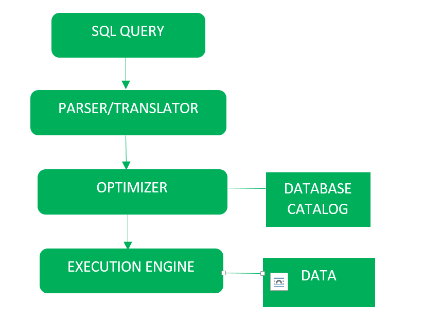
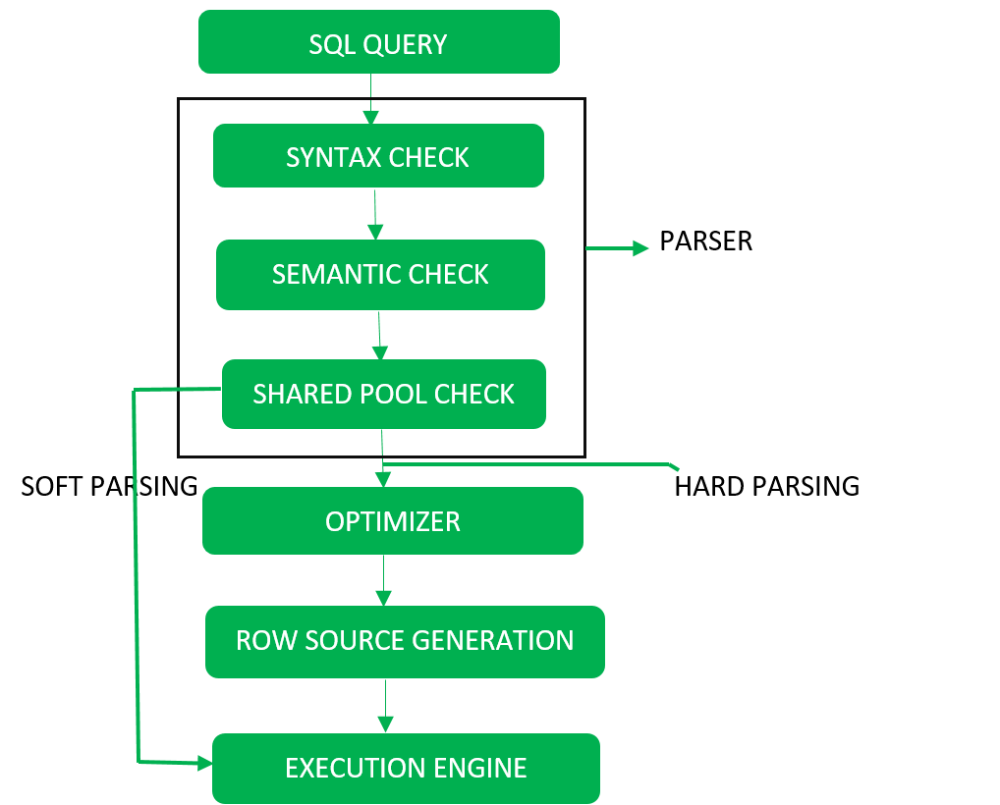
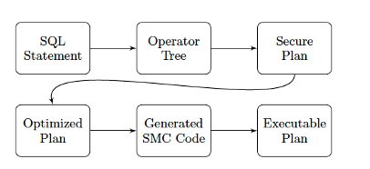

## Query Processing

Query processing includes few steps. 

 

 

Detailed Diagram is drawn as 
 

 

### Step 1 : Parser/Translator

### Parser
1. Syntax check
   - concludes SQL syntactic validity : grammar check
2. Semantic check
   - determines whether the statement is meaningful or not.  
     EX ) query contains a tablename which does not exist is checked by this check
3. Shared Pool check
   - Every query processes a hash code during its execution. So this check determines existence of written hash code in shared pool if code exists in shared pool then database will not take additional steps for optimization and execution. 
     - Shared Pool : The area of the System Global Area (SGA) that contains structures such as the data dictionary cache and the shared SQL area
- Hard Parse and Soft Parse  
If there is a fresh query and its hash code does not exist in shared pool then that query has to pass through from the additional steps known as hard parsing otherwise if hash code exists then query does not passes through additional steps. It just passes directly to execution engine (refer detailed diagram). This is known as soft parsing.
Hard Parse includes following steps – Optimizer and Row source generation.

### Step 2  
### Optimizer
During optimization stage, database must perform a hard parse atleast for one unique DML statement and perform optimization during this parse. This database never optimizes DDL unless it includes a DML component such as subquery that require optimization.
* DDL:
DDL is Data Definition Language which is used to define data structures. For example: create table, alter table are instructions in SQL.

* DML:
DML is Data Manipulation Language which is used to manipulate data itself. For example: insert, update, delete are instructions in SQL.

* Detail of DDL & DML difference : https://www.geeksforgeeks.org/difference-between-ddl-and-dml-in-dbms/

It is a process in which multiple query execution plan for satisfying a query are examined and most efficient query plan is satisfied for execution.
Database catalog stores the execution plans and then optimizer passes the lowest cost plan for execution.

### Row Source Generation 
The Row Source Generation is a software that receives a optimal execution plan from the optimizer and produces an iterative execution plan that is usable by the rest of the database. the iterative plan is the binary program that when executes by the sql engine produces the result set.

## Step-3
### Execution Engine 
Finally runs the query and display the required result. 

## How does these steps are achieved at SMCQL 

 

 

### SQL Statement -> Operator Tree
The honest broker starts with a SQL statement provided by the user. The statement is written against the PDN’s shared schema   
Parser : The honest broker parses the statement into a directed acyclic graph(DAG) using well-known techniques. 
This tree of database operators(=Operator Tree) provides the steps needed to compute a given query.   
The honest broker examines this tree, confirming that it is runnable within the PDB’s security policy.   
Security policy(sec 5.1) : enables the SMCQL optimizer to create efficient, secure plans.  
-	Public attributes : readable by all parties, including the honest broker, data providers, and end users, lowest sensitivity, and often have a low probability of being independently replicable. 
-	Protected data : visible in their originating site and conditionally available to the end user and honest broker / uses k-anonymity to control access to protected attributes. 
-	Private attributes : most sensitive ones in a PDN, not disclosed to anyone outside of the initial data provider. Computation over these attributes must be carried out obliviously, not appear in any results returned to the user. 

### Secure plan
Add Secure plan between operator tree and optimized plan, because this process needs to be done obliviosly. So we need to consider how to preserve privacy and how to improve efficiency.   
Generate a secure plan that identifies the minimal subtree in the query’s DAG that must run obliviously to uphold the PDN’s security policy. The planner traverses the tree bottom-up, modeling the flow of sensitive attributes through its nodes.  

Secure Information Flow(sec 5.2) :  
to minimize the number of operators it runs securely. 
In each operator, examine the provenance of its output columns and determine the protection level needed for each one by taking the maximum security policy of its source attributes. 
-> Uses grammar 1  
Label each relation algebra operator into one of two categories. :
1.	Tuple-at-a-time : 
  No need for secure evaluation unless they consume data from one or more secure children. EX) scan, project, limit, and filters with low predicates
2.	Multi-tuple evaluation
  Combine data from multiple source engines, execute at the level of their most sensitive inputs. EX) sorts, joins, and set

### Opimized Plan
Optimizes the secure query tree using heuristics that partition database operators into small, scalable units of secure computation.   

Begins with a secure query plan(=each operator is labelled high or low using the type checker in Sec 5.2), then transforms this logical plan into a low-level physical one. Using heuristics, SMCQL reduces a secure plan’s use of secure computation and partitions query evaluation into small, scalable units.   

(Logical plan into physical one) 
Optimizer slice its secure query evaluation by partitioning the input data into smaller, more manageable units of computation. 
- Enables us to reduce our secure code complexity, so speeding up the secure computation of eligible queries
- Makes it possible to parallelize secure query evaluation   

Optimizer assigns each operator in a secure plan to one of three execution modes :
1.	Plain : operators are of type low and they evaluate in the source database
2.	Sliced : high operators run securely over tuples that are horizontally partitioned by a public expression
3.	Secure : high operators executed using a single SMC program run on the inputs of all data providers. 
Used algorithm 1 
  

(minimizing secure computation)  
Delays its entry into SMC by partially computing an operator in a lower execution mode, and reduces the data that the engine evaluates securely
1.	Split operators : splittable operator may partition its execution into discrete phases. Each splittable operator has low and high phase. So do the low phase first. 

  
(Optimized Plans)  
Put all things together.
In summary, optimize our use of secure computation in three ways.
1.	Horizontally partitions the data over public attributes to reduce the time and complexity of our oblivious computing
2.	Query evaluator splits up query operators to prolong its time in a less expensive execution mode
3.	Identifies tuples that do not require distributed secure computation and evaluates them within their source DBMS. 

### Generated SMC code
Armed with a tree of optimized operator specifications, the planner generates SMC code for execution on the data providers using the techniques in Secure Query executor.   

Secure Query Executor : Sec 4 
The process whereby SMCQL translates physical operators in a PDN plan into executable, secure code.  
Secure code uses garbled circuits to jointly compute an operator over the participating parties., and stores the result in ORAM  
Uses ObliVM  

For each relational algebra operator, the code generator looks up a template for it and populates this outline with query-specific information including the width of its tuples in bits and filter predicates. 

### Executable plan
When the code generator completes we have an executable secure plan. 
The honest broker distributes the compiled secure code to the data providers, along with plaintext source queries for generating inputs for SMC. The data providers run their source SQL queries within their databases with standard methods and coordinate with one another to generate and evaluate garbled circuits for the secure operators using the specifications provided by the SMC code. 

## Reference
- https://mode.com/sql-tutorial/introduction-to-sql/
- https://help.sap.com/doc/saphelp_nw73ehp1/7.31.19/en-US/c4/3a7209505211d189550000e829fbbd/content.htm?no_cache=true

