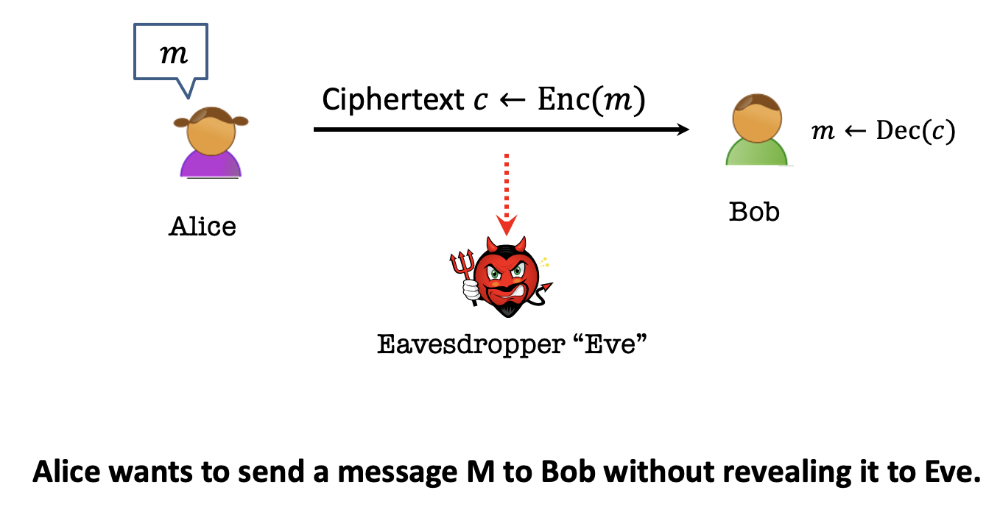
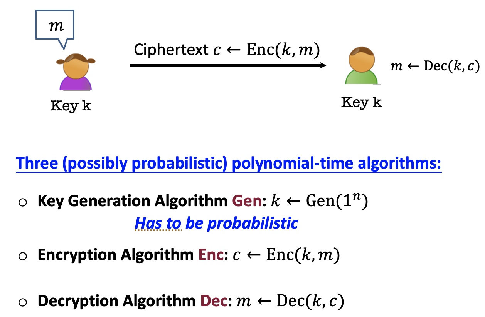
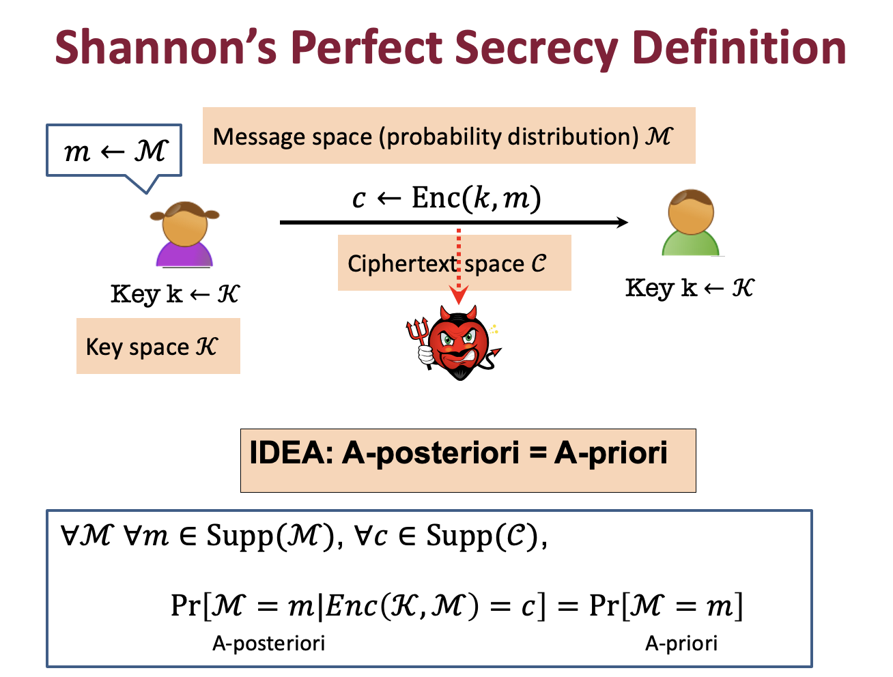

### Notice

This posting is based on Prof. Vinod Vaikuntanathan's <b>MIT 6.875 Foundations of Cryptography (Fall 2021)</b> lecture.  

Lecture link : [http://mit6875.org](http://mit6875.org)

Reference : [The Joy of Crpytography](https://joyofcryptography.com) by Mike Rosulek
    
### Secure Communication
#### Encryption Basics & Terminology
 

 
Cryptography is based on above scenario.

Alice has a message m, which is the <b>plaintext</b>. 
Plaintext is transformed into a value c, which is the <b>ciphertext</b>.  
The process of transforming m into c is called encryption (<b>Enc</b>), and when Bob receives c, he runs a corresponding decryption algorithm (<b>Dec</b>) to recover the original plaintext m.  
We assume that the ciphertext may be observed by the eavesdropper Eve, so the goal is for the ciphertext to be meaningful to Bob but meaningless to Eve.  

#### Secrets & Kerckhoff's Principle 
If we want Bob to be able to decrypt c, but Eve to not be able to decrypt c, then Bob must have some information that Eve doesn’t have. Something has to be kept secret from Eve.  
You might suggest to make the details of the Enc and Dec algorithms secret. 

In the last 2000 years,  the details of the Enc and Dec algorithms are secret. However, it has major drawbacks. 
If the attacker does eventually learn the details of Enc and Dec, then the only way to recover security is to invent new algorithms.  
The first person to articulate this problem was <b>Augeste Kerckhoffs</b>.  

> Kerckhoffs’ Principle:
“Il faut qu’il n’exige pas le secret, et qu’il puisse sans inconvénient tomber entre les mains de l’ennemi.”
 
> Literal translation: [The method] must not be required to be secret, and it must be able to fall into the enemy’s hands without causing inconvenience.

If the algorithms are not secret, there must be some other secret information in the system. That information is called the <b>(secret) key</b>.
Another way to interpret Kerckhoff's principle is that all of the security of the system should be concentrated in the secrecy of the key, not the secrecy of the algorithms. 

 

 
The process of choosing a secret key is called key generation, and we write <b>KeyGen</b> to refer to the (randomized) key generation algorithm. We call the collection of three algorithms <b>(Enc, Dec, KeyGen)</b> an encryption scheme. Remember that Kerckhoffs’ principle says that we should assume that an attacker knows the details of the KeyGen algorithm. But also remember that knowing the details (i.e., source code) of a randomized algorithm doesn’t mean you know the speci c output it gave when the algorithm was executed. 

Why key generation algorithm has to be probabilistic?  
 -> If deterministic, adversary can run this and get the key. 

To sum up, we assume the worst-case adversary as follows. 
*  An arbitrary computationally unbounded algorithm EVE. 
* Eve knows Alice and Bob's algorithms Gen, Enc, and Dec but does not know the key nor their internal randomness. 
* Eve can see the ciphertexts going through the channel. (cannot modify them, but powerful adversary can modify them in the later lecture)

From this assumation, we can have a key question <b>"What is the adversary trying to learn?"</b>, and conversely <b>"What are we trying to prevent the adversary from learning"</b>. 
These questions will lead us to the security definition. 
 
### Shannon’s Perfect Secrecy Definition
 

 
\begin{equation}
\forall EVE  
 Pr[EVE(Enc(k,m)) = m] <= 1/|m|  
  k\leftarrow Gen(1^n)
  m\leftarrow M(=probability \, distribution)
\end{equation}

