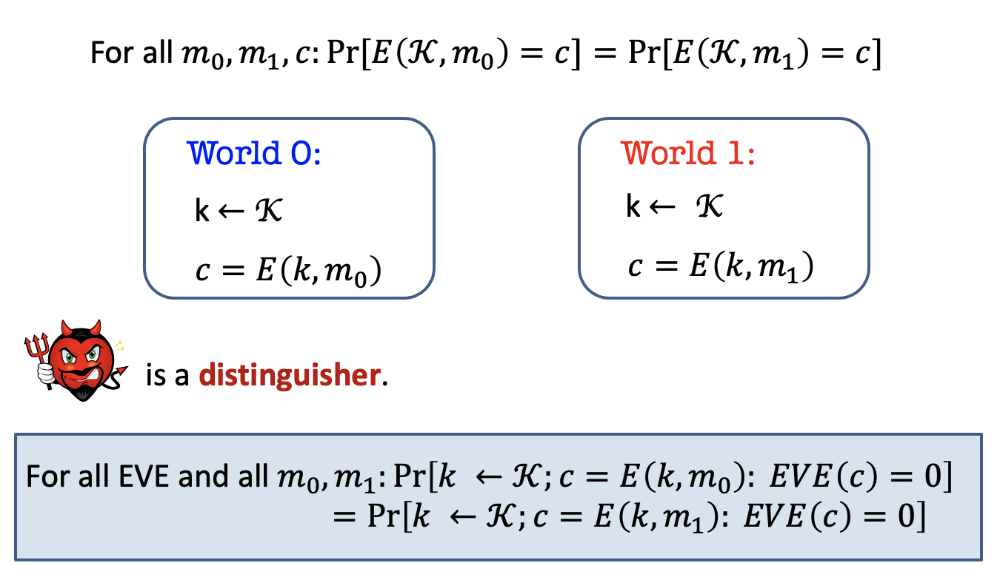
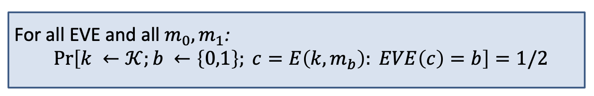
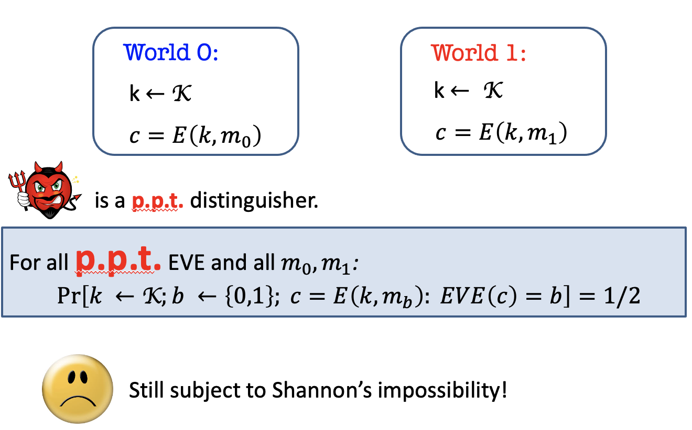
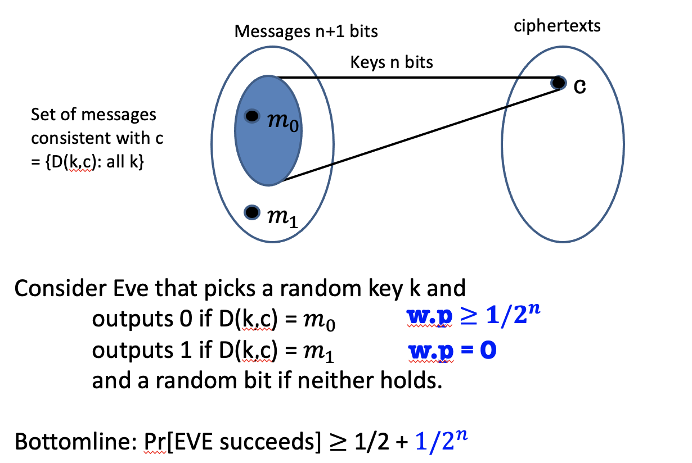

### Notice

This posting is based on Prof. Vinod Vaikuntanathan's <b>MIT 6.875 Foundations of Cryptography (Fall 2021)</b> lecture.  

Lecture link : [http://mit6875.org](http://mit6875.org)

Reference : [The Joy of Crpytography](https://joyofcryptography.com) by Mike Rosulek
    

In the last lecture, we learned that oen-time pad is a perfectly secure scheme, but it has limitation that keys need to be equal or longer than messages. Therefore, we relax the definition that EVE is an arbitrary computationally bounded algorithm.  

This lecture, we start from how can we overcome Shannon's conundrum. 
#### Perfect Indistinguishability: a Turing test

Before relaxing the definition, let's recall the perfect indistinguishability.  
In the blue box definition, you pick a random key from key space, encrypt the m0 with key k to c, give EVE c, and see what is the chance for EVE guess 0. (0 means that you guess you are in world 0)  
Second experiment is exactly same, but encrypt m1. And the probability of two experiement is same.  
We can change the definition as follows. 

Pick a key from key space, pick random bit from {0,1} meaning which world that I am going to in, 
and make EVE to guess which world she is in.  
This should be half.  
This is what we are now, and <b>we want to change this definition. </b>

#### Computationally Bounded Adversaries

#####  The Axiom of Modern Crypto

p.p.t. = probabilistic polynomial-time 
Alice and Bob are fixed p.p.t. algorithms.  
Eve is any p.p.t. algorithm that we have no control.  

Given this axiom, we can reformulate the definition. 

#####  Computational Indistinguishability (take 1)

Before, it was for <b>all</b> EVE, but now it is for all <b>p.p.t.</b> EVE.   
This is still subject to Shannon's impossibility.  
You cannot have encryption scheme that satisfies this definition and encrypts n+1 bit message, given an n bit key.  
Why?  

It is slightly larger than half.  
<b>We insisted on the adversary having no advantage better than a half. </b>  

What should we do next ?  

##### Negligible Functions
Functions that grow slower than $1/p(n)$ for any polynomial p. 

Good property of negligible function : If q(n) be a negligible function and p(n) a polynomial function, then q(n)*p(n) is a negligible function

##### Security Parameter : n (sometimes λ)

n is input to all these algorithms. 

#####  Computational Indistinguishability (take 2)

The probability that every p.p.t. EVE guesses the world correctly is at most half + negligible function in n. 
