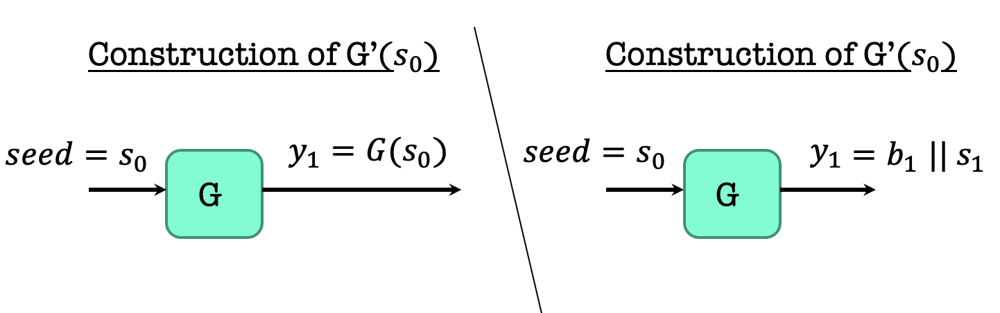

### Notice

This posting is based on Prof. Vinod Vaikuntanathan's <b>MIT 6.875 Foundations of Cryptography (Fall 2021)</b> lecture.  

Lecture link : [http://mit6875.org](http://mit6875.org)

Reference : [The Joy of Crpytography](https://joyofcryptography.com) by Mike Rosulek
    
  
  
### Recap 
  In the last lecture, we get a new definition of security for secret-key encrytion that helps us overcome Shannon's lower bound.  
Also, we get new notion PRG, which allow us to encrypt a single message longer than the key.  
We saw candidate construction using the hardness of the subset sum problem.  

For today and next later, go deeper using PRG to encrypt better and better.  

  

### Today
Two things today. 
1. PRG length extension 
2. Pseudorandom Functions 
Really important to know new proof technique : Hybrid Arguments  

### Three definitions of Pseudorandomness
  

Last time, we looked at the def 1. So today, we will look at def 2.  
  

For every ith bit, the guy cannot predict the ith bit given the first i-1 bits, the guy cannot predict it better than half.  

<b>Def 1 and Def 2 are Equivalent</b>  

A PRG G is indistinguishable if and only if it is next-bit unpredictable.  
A PRG G passes all (poly-time) statistical tests if and only if it passes (poly-time) next-bit tests.  
<b>What is important is Next-bit Unpredictability (NBU) is seemingly much weaker requirement, but NBU = Indistinguishability. Therefore NBU often much easier to use. </b>  

If you are interested in why indinstinguishability = NBU, watch the video.  

#### Our Predictor P
The idea : The predictor is given the first i-1 pseudorandom bits (call it y1y2, ... yi-1) and needs to guess the i-th bit.  
  

#### Analysis of the predictor P

$Pr[P(y1, ..., yi-1)=yi]>=1/2+1/p(n)$  
We want the probability that P given y1 up to yi-1 predicts yi, and want this bigger than half + poly.  
$Pr[P(y1, ..., y-1)=yi] \; = \; Pr1[D(y1,..yi-1 \, b \, ui+1, ... um) = 1 \, &b=yi]+Pr2[D(y1,..yi-1 \, b \, ui+1, ... um) = 0 \, \and b\ne yi], where \; b \; is \; random \; bit$  

Pr1 means that b, the bit that I fed him is the right bit and the guys say 1, then I will put b  
Pr2 means that b, the bit that I fed him is the wrong bit and the guys say 0, then I will take the b and flip it.  
  
$Pr[P(y1, ..., y-1)=yi] \; = \; Pr[D(y1,..yi-1 \, b \, ui+1, ... um) = 1 \, |b=yi]*Pr[b=yi]+Pr[D(y1,..yi-1 \, b \, ui+1, ... um) = 0 \, |b\ne yi]*Pr[b\neyi]$  
$Pr[b=yi] = 1/2, Pr[b \ne yi]= 1/2$ , therefore  
$= 1/2(Pr[D(y1,..yi-1 \, b \, ui+1, ... um) = 1 \, |b=yi]+Pr[D(y1,..yi-1 \, b \, ui+1, ... um) = 0 \, |b\ne yi])$  
Like this, it follows the below equation.  
  

### Length extension : One bit to Many bits 

Let G: 〖{0,1}〗^𝑛  →〖{0,1}〗^(𝑛+1) be a pseudorandom generator.  
Goal: use G to generate poly many pseudorandom bits.   
  
First, we generate n+1 bit, which is y1. b1 is one bit, and s1 is last n bits. 
  
This is called a <b>stream cipher</b>. You can stretch n bits to any polynomial bit.  
  

