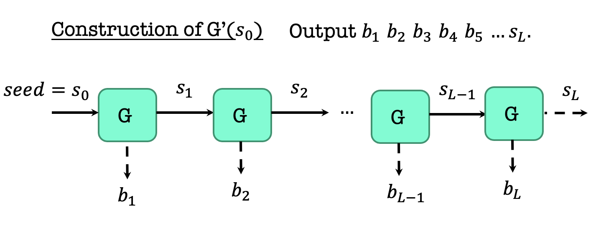
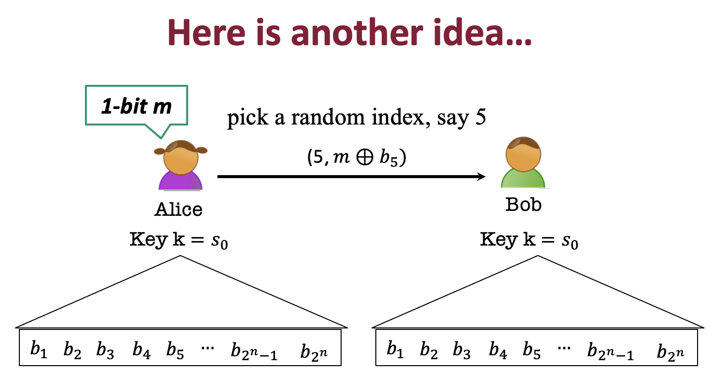

### Notice

This posting is based on Prof. Vinod Vaikuntanathan's <b>MIT 6.875 Foundations of Cryptography (Fall 2021)</b> lecture.  

Lecture link : [http://mit6875.org](http://mit6875.org)

Reference : [The Joy of Crpytography](https://joyofcryptography.com) by Mike Rosulek
    
  
  
### Recap 
  In the last lecture, we get a new definition of security for secret-key encrytion that helps us overcome Shannon's lower bound.  
Also, we get new notion PRG, which allow us to encrypt a single message longer than the key.  
We saw candidate construction using the hardness of the subset sum problem.  

For today and next later, go deeper using PRG to encrypt better and better.  

  

### Today
Two things today. 
1. PRG length extension 
2. Pseudorandom Functions  

Really important to know new proof technique : Hybrid Arguments  

### Three definitions of Pseudorandomness
  

Last time, we looked at the def 1. So today, we will look at def 2.  
  

For every ith bit, the guy cannot predict the ith bit when given the first i-1 bits, the guy cannot predict it better than half.  

<b>Def 1 and Def 2 are Equivalent</b>  

A PRG G is indistinguishable if and only if it is next-bit unpredictable.  
A PRG G passes all (poly-time) statistical tests if and only if it passes (poly-time) next-bit tests.  
<b>What is important is Next-bit Unpredictability (NBU) is seemingly much weaker requirement, but NBU = Indistinguishability. Therefore NBU often much easier to use. </b>  

If you are interested in why indinstinguishability = NBU, watch the video.  

#### Our Predictor P
The idea : The predictor is given the first i-1 pseudorandom bits (call it $y_{1} \, y_{2}, ... y_{i-1}$) and needs to guess the i-th bit.  
  

#### Analysis of the predictor P

$Pr[P(y_{1}, ..., y_{i-1})=y_{i}]>=1/2+1/p(n)$  
We want the probability that P given y_{1} up to y_{i-1} predicts y_{i}, and want this bigger than half + poly.  
$Pr[P(y_{1}, ..., y_{i-1})=y_{i}] \; = \; Pr1[D(y_{1},..y_{i-1} \, b \, u_{i+1}, ... u_{m}) = 1 \, AND \; b=y_{i}]+Pr2[D(y_{1},..y_{i-1} \, b \, u_{i+1}, ... u_{m}) = 0 \, AND \; b\ne y_{i}], where \; b \; is \; random \; bit$  

Pr1 means that b, the bit that I fed him is the right bit and the guys say 1, then I will put b  
Pr2 means that b, the bit that I fed him is the wrong bit and the guys say 0, then I will take the b and flip it.  
  
$Pr[P(y_{1}, ..., y_{i-1})=y_{i}] \; = \; Pr[D(y_{1},..y_{i-1} \, b \, u_{i+1}, ... u_{m}) = 1 \, |b=y_{i}]*Pr[b=y_{i}]+Pr[D(y_{1},..y_{i-1} \, b \, u_{i+1}, ... u_{m}) = 0 \, |b\ne y_{i}]*Pr[b \ne y_{i}]$  
$Pr[b=y_{i}] = 1/2, Pr[b \ne y_{i}]= 1/2$ , therefore  
$= 1/2(Pr[D(y_{1},..y_{i-1} \, b \, u_{i+1}, ... u_{m}) = 1 \, |b=y_{i}]+Pr[D(y_{1},..y_{i-1} \, b \, u_{i+1}, ... u_{m}) = 0 \, |b\ne y_{i}])$  
Like this, it follows the below equation.  
  

### Length extension : One bit to Many bits 

Let $G: \left\{0,1\right\}^𝑛 →\left\{0,1\right\}^{𝑛+1}$ be a pseudorandom generator.  
Goal: use G to generate poly many pseudorandom bits.   
  
First, we generate $n+1$ bit, which is $y_{1}$. $b_{1}$ is one bit, and $s_{1}$ is last $n$ bits.  
  
You output the one bit and keep the last n bits. And then apply the PRG again. If you keep doing this process, you can get the figure below. 
  
Like this, you can get the any length that you want. Output is the concatenation of this. 
This is called a <b>stream cipher</b>. You can stretch n bits to any polynomial bit.  

#### Stateful Encryption of Many Messages. 
  
Alice wants to send 1-bit message m, so she used PRG to get b1 and used it for one-time pad.  
  
Now, their current state are s1. We do not want to use b1 again, because we do not want to use one-time pad again.  
  
Let's assume that Alice wants to send 3-bit message, so she runs the 3 steps.  
  
So when we encrypt many messages, then Alice and Bob need to keep states.  
  
There are some drawbacks of using stateful encryption. Can we make it to be stateless?  
  
Use the PRG for huge polynomial times and write down all of this. And pick random index and use corresponding bit for one-time pad. 
  
  
Use the PRG for very huge length.   
  
We can get some points of aforementioned idea.  
  

### Pseudorandom Functions
  

  
We want these two functions to be indistinguishable.  

  

  
Comparing with before, encryption scheme is changed. One-time pad and all the other encryption schemes that we used were deterministic. They had the key and the process was deterministic. But this encryption now is randomized encryption.  
  
