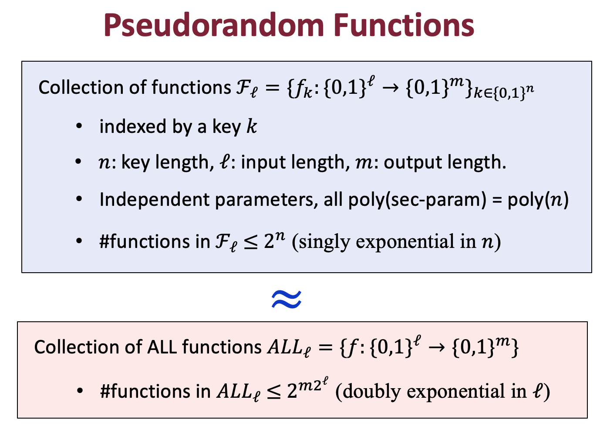

### Notice

This posting is based on Prof. Vinod Vaikuntanathan's <b>MIT 6.875 Foundations of Cryptography (Fall 2021)</b> lecture.  

Lecture link : [http://mit6875.org](http://mit6875.org)

Reference : [The Joy of Crpytography](https://joyofcryptography.com) by Mike Rosulek
    
  

  

### Pseudorandom Functions
  

  

Let's mathematically formulize this.  

  

In the pseudornadom world, there is polynomial time algorithm D that gets access to a function chosen from pseudorandom family. $f$ is chosen randomly from $F_{l}$, which is the family of functions. 
