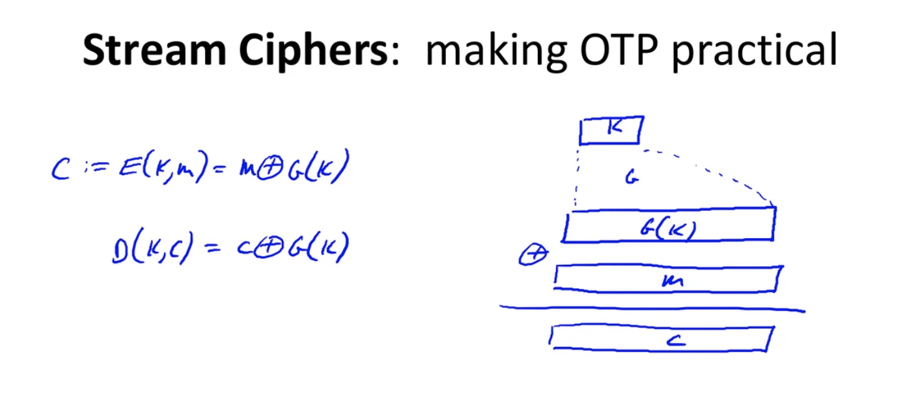
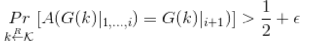

### Notice

This posting is based on Prof Dan Boneh's Cryptography I(Coursera)  

Reference : [https://cpuu.postype.com](https://cpuu.postype.com/post/162513) 
    
  
### Prologue
이 포스팅은 MIT 6.875 강의를 듣는데 필요한 기본 지식들에 대한 포스팅이다.  
MIT 6.875가 암호학의 기초라는 타이틀을 갖고 있고, 기초적인 정의부터 제대로 시작하는 것이 맞는 것 같다. 다만, 학부 때 들었던 수업에 비해 굉장히 수학적으로 접근을 많이 하기에 한 강의를 듣고 이해하는 것에 시간이 굉장히 많이 걸리고 있다. 해당 수업에 lecture 1부터 나오는 perfect secrecy, perfect indistinguishability 개념을 이해하기 위해 구글링을 하던 도중 블로그에 정리해주신 이 강의를 발견하게 되었고, 해당 내용을 읽어보니 굉장히 많이 도움이 되어 한국어로 강의를 번역해주신 내용에서 MIT 6.785를 이해하는 데 필요한 내용들을 다시 한 번 이번 포스팅에서 정리해보려고 한다.   

### 암호란 ? 
암호란 두 가지 알고리즘으로 이루어진다. 각각을 '암호화 알고리즘', '복호화 알고리즘'이라고 부른다. 그리고 암호는 K라는 key라는 요소가 필요하다. 암호화 알고리즘 E는 원문 메시지 M과 K를 사용하여 암호문 C를 생성한다. 그리고 복호화 알고리즘 D는 암호문 C와 K를 사용하여 원문 M을 복원해낸다. 두 알고리즘은 양립하며, 정확해야 한다는 특성을 갖고 있다. 모든 키와 메세지에 대해 성립해야 한다. 중요한 점으로는 암호화 E는 확률적 알고리즘(Randomized)이고, 복호화 D는 결정론적(Deterministic) 알고리즘이다. 암호화시에는 원본 메시지를 사용해서 전혀 다른 무작위의 비트들을 새롭게 생성해내고, 그 결과물은 암호 방법에 따라 달라질 수 있다. 하지만 복호화 알고리즘은 무작위한 성질을 갖지 않고, 항상 동일한 결과 값을 도출하도록 설계되어 있다.  
효과적이라는 말은 크게 두 가지로 해석된다. 이론에 관심을 두는 사람이라면 다항 시간(Polynomial time)안에 계산이 수행되어야 한다는 뜻으로 받아들이고, E와 D 알고리즘은 각각의 input 값에 따른 다항시간 안에 계산이 수행되어야 함을 증명하기 위해 논문을 쓴다. 이와 반대로 암호학적 실무에 종사하는 사람들은 알고리즘이 실제로 수행되는 시간이 얼마나 짧은지를 목적으로 한다.  

### 역사적인 암호
역사적인 암호로는 Substitioution 암호, Vigenere 암호 등이 있으나, 이는 이미 취약함이 공개되었으므로 절대 실무에서 사용하면 안 된다. 단순히 역사적으로 이런 암호들이 있었다는 것 정도로만 알고 지나가면 된다. 

### One-time pad
OTP의 특징은 암호화하려는 메시지가 있다면, 그 메시지의 길이 만큼의 동일한 space를 갖는 key가 필요하고, 암호문 역시 동일한 space의 string이 된다.  
OTP는 성능 측면에서 꽤 우수하다. 단순히 key와 메시지를 XOR 하는 연산만을 수행함으로써 암호화를 하기 때문에, 아주 긴 메세지라도 굉장히 빠른 속도로 처리할 수 있다.  
<b>하지만 현실세계에서 OTP는 활요하기 어렵다. 왜냐하면 메세지가 길어지면 key도 길어져야 하기 때문이다.</b>
현실에서 적용하기 어렵지만, OTP의 작동 방식을 잘 이해할 필요가 있다. 그렇다면 다음과 같은 질문을 갖게 된다.  
과연 OTP는 얼마나 안전한 것인가 ?  
이 질문에 대한 답을 하기 위해서는 <b>안전하다는 것은 정확히 어떻게 증명할 것인가? 그 기준이 무엇인가?</b>에 대해 정의를 해야한다. 

#### 안전하다는 것은?
암호의 안전성에 대해 학문적으로 논하기 위해서는 정보 이론(Information theory)를 살펴봐야 한다. 정보 이론의 창시자인 Claude Shannon의 아이디어는 매우 중요하다. 그의 기본적인 아이디어는 다음과 같다. "암호문을 들여다보더라도, 그것으로부터 원문에 대한 정보를 전혀 알아낼 수 없다"이다.  
섀넌은 다음과 같이 완벽한 안전성에 대해 정의한다. 
$$
\begin{align*}
& A \; cipher (E,D) \; over \; (K,M,C) \; has \; perfect \; secrecy \; if \\
& \forall m0,m1 \in M \; (len(m0)=len(m1)) \; and \; \forall c \in C \\
& Pr[(Enc(k,m0)) = c] = Pr[(Enc(k,m1)) = c] \\
& where \; K \; is \; uniform 
\end{align*}
$$

위의 공식을 분석하면 다음과 같다.  
임의의 메세지 m0와 m1에 대하여, m0와 m1의 길이가 서로 같고, k가 uniform distribution일 때, 그 각각을 암호화한 E(k,m0)와 E(k,m1)의 결과가 c가 될 확률이 서로 동일하다면 그 암호문은 perfect secrecy하다.  
만일 공격자가 특정한 암호문 C를 얻었다고 가정하면, 이 C의 원본인 M을 찾기 위해 애를 써도, C로부터 M을 찾아낼 확률이 모든 경우의 수에 대해 동일한 값으로 일정하다는 것이다. 여기서 그렇다면 두 확률이 같다는 말은 무슨 뜻인가 ? 이 뜻은 공격자가 C가 m0의 암호화된 결과물인지 m1의 암호화된 결과물인지 확률이 동일하므로 알 수 없다는 것을 의미한다.  
OTP는 perfect secrecy를 갖고 있으므로 암호문으로부터 평문과 관련된 아무런 정보를 얻어낼 수 없다. 그러므로 ciphertext only attack은 OTP 방식에 소용이 없다.  
하지만, OTP는 치명적인 단점이 존재한다. OTP는 암호화 키의 길이 상당히 길 수 밖에 없다. 자신의 메세지의 길이만큼이나 똑같은 긴 키를 사용해야 하기 때문이다. 그러므로 OTP의 효율을 높이기 위해서 키의 길이를 줄일 수 있는 방법이 있는지 고민을 해보아야 하지만, 그런 방법은 없다. 섀넌은 OTP의 안정성을 증명함과 동시에 한 가지 제약조건을 언급하였는데, 그것은 바로 <b>키의 길이는 메세지의 길이보다 크거나 같을 수 밖에 없다</b>라는 것이다. 이것이 최악의 단점인 이유는 메세지 송신자와 수신자가 안전하게 통신을 하고 싶어서 암호화를 수행하고, 암호화에 필요한 키를 서로 공유해야하는데 이 과정에서 키의 길이가 메세지처럼 길다면 배보다 배꼽이 더 커지는 상황이 되는 것이다. 이 단점 때문에 OTP는 현실 세계에서 거의 사용되지 않는다. 그렇다면 OTP의 장점을 살리되, 단점을 최소화할 수 있는 방책은 없는 것인가?  

#### Practical version of OTP
OTP는 암호화 키인 K와 메세지 M을 XOR 연산을 수행하는 것으로 빠르게 암호화를 수행할 수 있다. 또한 암호문 C에 다시 K를 XOR하면 복호화까지 수행되는 방식이다. OTP는 다른 암호 방식에 비해 암호문 단독 공격으로부터 perfect secrecy함이 입증되었다. 즉, 공격자는 암호문 C로부터 원문 M에 대한 그 어떠한 정보도 얻을 수 없는 것이다. 이러한 장점에도 불구하고, OTP는 단점이 있다. OTP를 수행하기 위해서는 키의 길이가 메세지의 길이 이상으로 길어야만 한다는 점이다. 따라서 OTP의 장점은 살리고, 단점을 최소화하는 방책으로 OTP의 실용적인 버전인 "Stream Cipher"가 나오게 되었다. 원래는 Totally random key(완전히 무작위적인 난수로 이루어진 암호화 키)를 사용해야 하지만, 이것을 조금 단순화 시켜서 Pseudo-random key(의사 난수)로 대체하는 것이다.  

##### Pseudo Random Generator (PRG)
의사 난수를 생성하는 Function을 의사난수 생성기라고 한다. 이 함수는 전체 스페이스인 N보다 차원을 축소시킨 S만큼의 스페이스를 seed로 설정한다. 즉, {0,1}^S인 S-bit의 값이 seed가 되며, 해당 함수를 통해 {0,1}^N인 N-bit 문자열로 매핑시키는 것이다. 이 때, N >> S인, N이 S보다 훨씬 더 큰 값으로 가정한다. 예를 들어 S가 128 bit 정도의 길이라면, 결과 값은 기가 바이트 단위의 데이터가 될 수도 있다. 이것이 PRG의 역할이며, 이 기능을 수행할 때, 효과적으로 그 값을 계산해낼 수 있다고 가정한다. 이 알고리즘은 빠르게 계산이 가능하여야하며, 결정론적(deterministic)이다. 실제로 무작위적인 값은 seed이며, 이 seed의 작용으로 인한 결과물은 마치 '무작위인 것처럼 보이는 (look random)' 값이 도출된다. 무작위가 아닌 무작위처럼 보인다는 의미는 조금 이따가 설명하겠다.  

따라서 PRG라는 함수를 활용한 OTP는 아래 그림과 같다.  
  
OTP에서는 암호화 키가 메세지 만큼 길어야 했지만, 이번에는 상당히 짧은 K를 사용한다. 이를 위해 PRG(K)를 계산하면 그 결과 값은 K를 활용한 랜덤인 것처럼 보이는 적절한 길이의 키가 생성된다. 이 값을 메세지 M과 XOR 연산을 하여 기존의 OTP 방식처럼 암호화를 수행할 수 있다. 공식으로 나타내면,  E(K,M) = M XOR PRG(K), D(K,C) = C XOR PRG(K)이다. 그렇다면 Stream Cipher도 perfect secrecy할까 ? <b>Stream Cipher는 키의 길이를 짧게 했기 때문에 perfect하다고 볼 수 없다. </b>  
그렇다면 perfect하지 않은 걸 왜 사용하는지 의문을 갖을 수 있다. 이를 위해서는 stream cipher의 안전성에 대한 기준을 재정립해야 한다. Stream cipher의 안전성은 사용했던 PRG 함수의 예측불가능성 여부(Unpredictable)에 의해 좌우된다. 따라서 예측가능성, 즉 Predictability를 이해해야 한다.  

만약 PRG가 예측 가능한 함수라고 가정해보겠다. 이 말은 곧 G(K)를 계산한 결과에서, 만약 i번째 값을 알고 있고, 그 지식을 이용해서 i+1 번째으 ㅣ값이라던지, 임의의 n번째 값을 획득할 수 있다는 뜻이다. 이런 경우라면 해당 PRG 함수는 굉장히 취약한 것이며 결코 안전하지 않은 함수이다. 왜냐하면 공격자가 우연히 메세지의 일부분을 획득했을 때, 그 정보의 내용을 토대로 나머지 부분을 추측할 수 있기 때문이다. 그러므로 예측가능한 PRG 함수를 사용한다면 공격자는 한 글자만 알아도 나머지 모든 글자를 추론함으로써 암호화 키를 획득할 수 있게 되는 치명적인 문제가 발생한다. 그렇기 때문에 Stream Cipehr에서 사용하는 PRG는 반드시 예측 불가능(Unpredictable)해야 안전한 것이다.  

Unpredictable의 의미를 조금 더 구체적으로 정의하겠다.  
$G \; : \; K \rightarrow \left\{0,1 \right\}^n $
이라는 function에 대해, 만약 효율적인 알고리즘 $A$와 $0<=i<=n-1$의 범위인 i번째 bit의 값이 있고, 아래의 식을 만족한다면, 이렇나 경우의 의사난수생성기능 predictable하다.  
  
위의 설명과 반대로, 모든 i번째 비트에 대해 i+1번째 bit를 높은 확률로 예측할 수 있는 효율적인 알고리즘 A가 결코 존재하지 않을 때, 이를 unpredictable하다고 정의한다.  

G가 예측가능하면 취약하기 때문에, 해당 PRG는 암호를 구현하는 상황에서 절대 사용해서는 안 된다. 예를 들어  선형 합동 생성기(Linear congruential generator, LCG)와 glibc 라이브러리의 random function()이 있다.  

Negligible과 non-negligible에 대한 개념은 암호학 연구자 그룹과 실무자 그룹 사이에서 바라보는 시각에 약간의 온도차가 있다. 연구자들은 ε가 1/2^30 (십억분의 1) 보다 큰 값이라면 이는 무시할 수 없는 값(Non-negligible)이라고 한다. 이 값이 매우 커보이지만, 1GB의 데이터가 2^30 ~ 2^32 정도이기 때문에 실제 우리의 실생활에서 상당히 현실적인 기준이다. 반대로, 1/ 2^80 보다 작은 값인 경우에는 현실적인 시간안에 발생할 가능성이 매우 드물다고 보기 때문에, Negligible(무시해도 좋은) 이벤트라고 정의한다. 이러한 정의는 약간의 오차가 발생한다는 점을 감안해야 한다. 조금 더 엄격하게 암호학 이론을 연구하는 사람들은 ε을 단순히 scalar 값으로 보는 것이 아니라, 하나의 function 으로 정의한다. 일종의 다항식 시간에 대입하여 λ값을 계산한다고 했을 때의 ε을 비교하는 방식이다.

