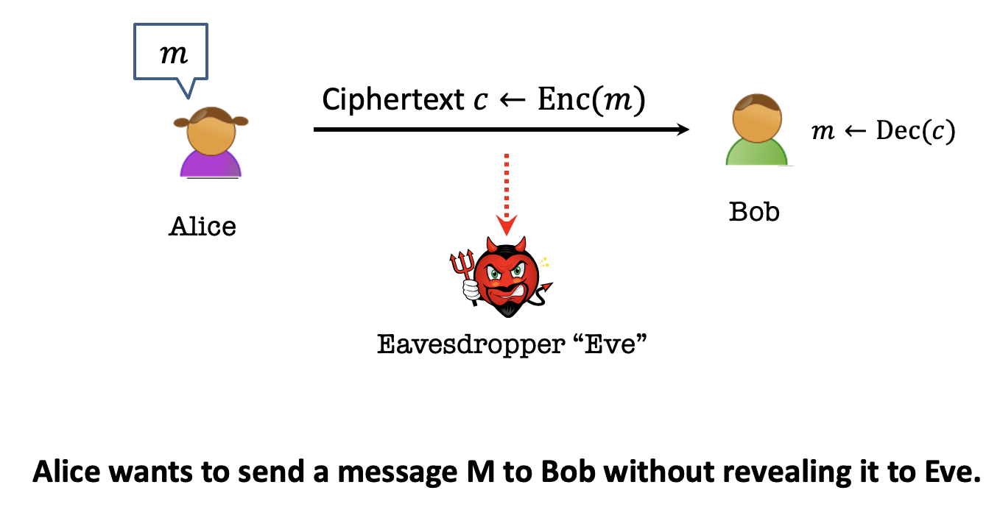

### Notice

This posting is based on Prof Dan Boneh's Cryptography I(Coursera)  

Reference : [https://cpuu.postype.com](https://cpuu.postype.com/post/162513) 
    
  
### Prologue
이 포스팅은 MIT 6.875 강의를 듣는데 필요한 기본 지식들에 대한 포스팅이다.  
MIT 6.875가 암호학의 기초라는 타이틀을 갖고 있고, 기초적인 정의부터 제대로 시작하는 것이 맞는 것 같다. 다만, 학부 때 들었던 수업에 비해 굉장히 수학적으로 접근을 많이 하기에 한 강의를 듣고 이해하는 것에 시간이 굉장히 많이 걸리고 있다. 해당 수업에 lecture 1부터 나오는 perfect secrecy, perfect indistinguishability 개념을 이해하기 위해 구글링을 하던 도중 블로그에 정리해주신 이 강의를 발견하게 되었고, 해당 내용을 읽어보니 굉장히 많이 도움이 되어 한국어로 강의를 번역해주신 내용에서 MIT 6.785를 이해하는 데 필요한 내용들을 다시 한 번 이번 포스팅에서 정리해보려고 한다.   

### 암호란 ? 
암호란 두 가지 알고리즘으로 이루어진다. 각각을 '암호화 알고리즘', '복호화 알고리즘'이라고 부른다. 그리고 암호는 K라는 key라는 요소가 필요하다. 암호화 알고리즘 E는 원문 메시지 M과 K를 사용하여 암호문 C를 생성한다. 그리고 복호화 알고리즘 D는 암호문 C와 K를 사용하여 원문 M을 복원해낸다. 두 알고리즘은 양립하며, 정확해야 한다는 특성을 갖고 있다. 모든 키와 메세지에 대해 성립해야 한다. 중요한 점으로는 암호화 E는 확률적 알고리즘(Randomized)이고, 복호화 D는 결정론적(Deterministic) 알고리즘이다. 암호화시에는 원본 메시지를 사용해서 전혀 다른 무작위의 비트들을 새롭게 생성해내고, 그 결과물은 암호 방법에 따라 달라질 수 있다. 하지만 복호화 알고리즘은 무작위한 성질을 갖지 않고, 항상 동일한 결과 값을 도출하도록 설계되어 있다.  
효과적이라는 말은 크게 두 가지로 해석된다. 이론에 관심을 두는 사람이라면 다항 시간(Polynomial time)안에 계산이 수행되어야 한다는 뜻으로 받아들이고, E와 D 알고리즘은 각각의 input 값에 따른 다항시간 안에 계산이 수행되어야 함을 증명하기 위해 논문을 쓴다. 이와 반대로 암호학적 실무에 종사하는 사람들은 알고리즘이 실제로 수행되는 시간이 얼마나 짧은지를 목적으로 한다.  

### 역사적인 암호
역사적인 암호로는 Substitioution 암호, Vigenere 암호 등이 있으나, 이는 이미 취약함이 공개되었으므로 절대 실무에서 사용하면 안 된다. 단순히 역사적으로 이런 암호들이 있었다는 것 정도로만 알고 지나가면 된다. 

### One-time pad
OTP의 특징은 암호화하려는 메시지가 있다면, 그 메시지의 길이 만큼의 동일한 space를 갖는 key가 필요하고, 암호문 역시 동일한 space의 string이 된다.  
OTP는 성능 측면에서 꽤 우수하다. 단순히 key와 메시지를 XOR 하는 연산만을 수행함으로써 암호화를 하기 때문에, 아주 긴 메세지라도 굉장히 빠른 속도로 처리할 수 있다.  
<b>하지만 현실세계에서 OTP는 활요하기 어렵다. 왜냐하면 메세지가 길어지면 key도 길어져야 하기 때문이다.</b>
현실에서 적용하기 어렵지만, OTP의 작동 방식을 잘 이해할 필요가 있다. 그렇다면 다음과 같은 질문을 갖게 된다.  
과연 OTP는 얼마나 안전한 것인가 ?  
이 질문에 대한 답을 하기 위해서는 <b>안전하다는 것은 정확히 어떻게 증명할 것인가? 그 기준이 무엇인가?</b>에 대해 정의를 해야한다. 

#### 안전하다는 것은?
암호의 안전성에 대해 학문적으로 논하기 위해서는 정보 이론(Information theory)를 살펴봐야 한다. 정보 이론의 창시자인 Claude Shannon의 아이디어는 매우 중요하다. 그의 기본적인 아이디어는 다음과 같다. "암호문을 들여다보더라도, 그것으로부터 원문에 대한 정보를 전혀 알아낼 수 없다"이다.  
섀넌은 다음과 같이 완벽한 안전성에 대해 정의한다. 
$$
\begin{align*}
& A \; cipher (E,D) \; over \; (K,M,C) \; has \; perfect \; secrecy \; if \\
& \forall m0,m1 \in M \; (len(m0)=len(m1)) \; and \; \forall c \in C \\
& Pr[(Enc(k,m0)) = c] = Pr[(Enc(k,m1)) = c] \\
& where \; K \; is \; uniform 
\end{align*}
$$

위의 공식을 분석하면 다음과 같다.  
임의의 메세지 m0와 m1에 대하여, m0와 m1의 길이가 서로 같고, k가 uniform distribution일 때, 그 각각을 암호화한 E(k,m0)와 E(k,m1)의 결과가 c가 될 확률이 서로 동일하다면 그 암호문은 perfect secrecy하다.  
만일 공격자가 특정한 암호문 C를 얻었다고 가정하면, 이 C의 원본인 M을 찾기 위해 애를 써도, C로부터 M을 찾아낼 확률이 모든 경우의 수에 대해 동일한 값으로 일정하다는 것이다. 여기서 그렇다면 두 확률이 같다는 말은 무슨 뜻인가 ? 이 뜻은 공격자가 C가 m0의 암호화된 결과물인지 m1의 암호화된 결과물인지 확률이 동일하므로 알 수 없다는 것을 의미한다.  
OTP는 perfect secrecy를 갖고 있으므로 암호문으로부터 평문과 관련된 아무런 정보를 얻어낼 수 없다. 그러므로 ciphertext only attack은 OTP 방식에 소용이 없다.  
하지만, OTP는 치명적인 단점이 존재한다. OTP는 암호화 키의 길이 상당히 길 수 밖에 없다. 자신의 메세지의 길이만큼이나 똑같은 긴 키를 사용해야 하기 때문이다. 그러므로 OTP의 효율을 높이기 위해서 키의 길이를 줄일 수 있는 방법이 있는지 고민을 해보아야 하지만, 그런 방법은 없다. 섀넌은 OTP의 안정성을 증명함과 동시에 한 가지 제약조건을 언급하였는데, 그것은 바로 <b>키의 길이는 메세지의 길이보다 크거나 같을 수 밖에 없다</b>라는 것이다. 이것이 최악의 단점인 이유는 메세지 송신자와 수신자가 안전하게 통신을 하고 싶어서 암호화를 수행하고, 암호화에 필요한 키를 서로 공유해야하는데 이 과정에서 키의 길이가 메세지처럼 길다면 배보다 배꼽이 더 커지는 상황이 되는 것이다. 이 단점 때문에 OTP는 현실 세계에서 거의 사용되지 않는다. 그렇다면 OTP의 장점을 살리되, 단점을 최소화할 수 있는 방책은 없는 것인가?  

### Secure Communication
#### Encryption Basics & Terminology
 

 
Cryptography is based on above scenario.

Alice has a message m, which is the <b>plaintext</b>. 
Plaintext is transformed into a value c, which is the <b>ciphertext</b>.  
The process of transforming m into c is called encryption (<b>Enc</b>), and when Bob receives c, he runs a corresponding decryption algorithm (<b>Dec</b>) to recover the original plaintext m.  
We assume that the ciphertext may be observed by the eavesdropper Eve, so the goal is for the ciphertext to be meaningful to Bob but meaningless to Eve.  

#### Secrets & Kerckhoff's Principle 
If we want Bob to be able to decrypt c, but Eve to not be able to decrypt c, then Bob must have some information that Eve doesn’t have. Something has to be kept secret from Eve.  
You might suggest to make the details of the Enc and Dec algorithms secret. 

In the last 2000 years,  the details of the Enc and Dec algorithms are secret. However, it has major drawbacks. 
If the attacker does eventually learn the details of Enc and Dec, then the only way to recover security is to invent new algorithms.  
The first person to articulate this problem was <b>Augeste Kerckhoffs</b>.  

> Kerckhoffs’ Principle:
“Il faut qu’il n’exige pas le secret, et qu’il puisse sans inconvénient tomber entre les mains de l’ennemi.”
 
> Literal translation: [The method] must not be required to be secret, and it must be able to fall into the enemy’s hands without causing inconvenience.

If the algorithms are not secret, there must be some other secret information in the system. That information is called the <b>(secret) key</b>.
Another way to interpret Kerckhoff's principle is that all of the security of the system should be concentrated in the secrecy of the key, not the secrecy of the algorithms. 

 

 
The process of choosing a secret key is called key generation, and we write <b>KeyGen</b> to refer to the (randomized) key generation algorithm. We call the collection of three algorithms <b>(Enc, Dec, KeyGen)</b> an encryption scheme. Remember that Kerckhoffs’ principle says that we should assume that an attacker knows the details of the KeyGen algorithm. But also remember that knowing the details (i.e., source code) of a randomized algorithm doesn’t mean you know the speci c output it gave when the algorithm was executed. 

Why key generation algorithm has to be probabilistic?  
 -> If deterministic, adversary can run this and get the key.  

#### The worst-case adversary

To sum up, we assume the worst-case adversary as follows. 
*  An arbitrary computationally unbounded algorithm EVE. 
* Eve knows Alice and Bob's algorithms Gen, Enc, and Dec but does not know the key nor their internal randomness. 
* Eve can see the ciphertexts going through the channel. (cannot modify them, but powerful adversary can modify them in the later lecture)

From this assumation, we can have a key question <b>"What is the adversary trying to learn?"</b>, and conversely <b>"What are we trying to prevent the adversary from learning"</b>. 
These questions will lead us to the security definition. 
$$
\begin{align*}
& \forall EVE \\
& Pr[EVE(Enc(k,m)) = m] = 0 \\
& k \leftarrow Gen(1^n), \; m \leftarrow M(=probability \, distribution) \\
\end{align*}
$$

(n is the length of the key, and M is the probability distributions on possible messages.)

This formula means that  
for every algorithm EVE, the probability that EVE gets plaintext m by using encryption of k and m is 0. 
 
However, this is impossible, and there is tiny advantage than 0.  
Therefore, we need to fix this formula as follows.  

$$
\begin{align*}
& \forall EVE \\
& Pr[EVE(Enc(k,m)) = m] \leq 1/|m| \\
& k \leftarrow Gen(1^n), \; m \leftarrow M(=probability \; distribution(uniform \; over \; some \; set)) \\
\end{align*}
$$

Is this achievable ?  

The answer is no. Message space is extraneous to us, so message space is not necessarily uniform. However, we can control the key space.  
We need some refinement to this formula. 

 
### Shannon’s Perfect Secrecy Definition
 

 

Before watching this definition, we need to know the basic meaning of conditional probability. 

$$
\begin{align*}
&P(A|B) = \frac {P(A \cap B)}{P(B)}
\end{align*}
$$

It refers to the probability that event A will occur when event B occurs.

Key idea is that you compare two worlds.  

* A-posteriori world
    * The adversary sees the ciphertext that goes through the channel, and trying to guess the message. 
    * A-posteriori probability that the mesage is equal to plaintext conditioned on the fact that EVE saw the ciphertext. 
* A-priori world 
    * This is the world that the adversary does not see anything at all, and just guess. 

A-posteriori = A-priori  
means that seeing the ciphertext does not matter at all. 
This is the theme that will come up again and again in cryptography. We compare two worlds. One, the real world, where the adversary has some information, which is the ciphertext. 
And Other, the ideal world where the adversary has no information.
We want to say that the adversary learns no more in the real world than in ideal world. 

### Perfect Indistinguishability Definition
 

 

Perfect indistinguishability definition is equivalent to perfect secrecy.  
Perfect indistinguishability is similar to a Turing test.  

She is given one of the two boxes and needs to decide which box am I interacting.   
The goal of the adversary is that trying to be a distinguisher, so that she can guess which world she is in.   
In each world, keys are generated randomly from a probability distribution, so keys are not the same.  

Cool thing is that these two definitions are equivalent.  
An encrption scheme (Gen, Enc, Dec) satisfies perfect secrecy IFF it satisfies perfect indistinguishability.
 

### One-time pad
Can we achieve perfect secrecy ? 
The answer is yes by using the one-time pad. 
One-time pad has two properties. 

* correctness
    * The first property of one-time pad that we should confirm is that the receiver does indeed recover the intended plaintext when decrypting the ciphertext. 
* security

Reusing a one-time pad is not perfectly secret. 

### Limitation
Perfect secrecy is achievable, but has its price.  
Any perfectly secure encryption scheme needs keys that are at least as long as the messages.  
Therefore, we need to relax the definition.  

EVE is an arbitrary <b>compuatationally bounded </b> algorithm.   
= EVE is a polynomial time algorithm  

