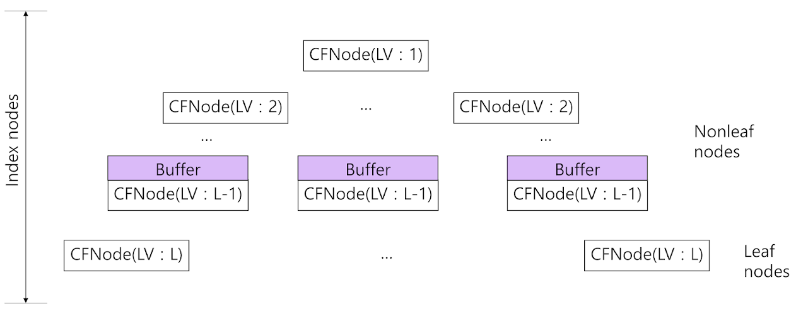
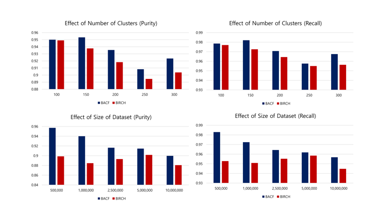

# Disk-based BACF Tree for Clustering Massive Dataset

## Project Explanation  

The main idea comes from <a href="https://www2.cs.sfu.ca/CourseCentral/459/han/papers/zhang96.pdf">BIRCH Clustering</a> and <a href="http://www.vldb.org/conf/1997/P406.PDF">Buffer Tree</a> Paper.  
Birch is a memory-based clustering algorithm that constructs a CF Tree to calculate clusters and repeatedly reconstructs the cf tree when the memory size is limited compared to the data size.  
In this case, the threshold value is increased until the entire cf tree fits the available memory. The Drawback of this algorithm is that the purity and recall of the cluster depend on the available memory size.  
In this project, We propose a disk-based tree called a Buffer Augmented Clustering Features(BACF) tree that combines the CF tree of BIRCH with a buffer tree that minimizes Disk I/O by using features of buffer, so the clustering performance for large amounts of data is good and the initial threshold value can be used without change until the tree is constructed.
  
            
## BACF Tree

            [Structure of BACF Tree]  

            

BACF tree is a height-balanced tree constructed by integrating the structures of CF Tree of BIRCH and Buffer Tree. Therefore it has the features of both CF Tree and Buffer Tree. Each node of BACF Tree has a similar CF(Clustering Feature) and node structure as CF Tree. However, there is one difference between Buffer Tree and BACF Tree. In the buffer tree, all nodes have buffers, but in the BACF tree, only nodes that are one level above the leaf node have buffers. The reason is that when the buffer was added to all nodes, the disk I/O decreased, but the rate at which the data were reflected in the leaf node slowed, resulting in a decrease in the Purity and Recall of the cluster. Therefore, in order to have good performance in both disk I/O, cluster Purity, and Recall, the buffer was added only just above the leaf node, not the entire tree. We used CF definition of BIRCH in the BACF tree.
  
            
## Construction of BACF Tree through Data Insertion

Basic insertion of BACF Tree is the same as CF Tree. Also, the buffer management of BACF Tree for data insertions is similar to that of the Buffer Tree. Like the Buffer Tree, an insertion process is in one of the three states active, blocked, and terminated. Only one of the insertions processes is active at a time, while the others are either blocked or terminated. An active insertion process is terminated if its data is absorbed by a leaf node entry. An active insertion process becomes blocked when its corresponding data is inserted into the buffer of the index node it arrives. A blocked insertion process will be reactivated at a later point of time when the buffer is overflowed. We now give an algorithm for inserting data into a BACF Tree.  

Limited memory size M and limited tree-level V are given, and the size of the current tree P must be continuously calculated on each data insertion. After data insertion, we need to check if P>M. If so, execute algorithm #7.  
    <blockquote> 1.    Identifying the appropriate node for insertion : Starting from the root, it recursively descends the BACF Tree by choosing the closest child node according to the Euclidean distance metric. While descending the BACF tree, when it arrives at the node that has buffer, an active insertion process becomes blocked. This is because its corresponding data is inserted into the buffer without going down to its child node.</blockquote>

<blockquote> 2.    Top-down CF update : When the data pass through the index node, the CF of the index node is updated by incorporating this new data. This process proceeds until the data is inserted into the buffer. This kind of CF update is named as Top-down CF update. Top-down CF update is used only when it is used as the update scheme for CFs of BACF tree.</blockquote>

<blockquote> 3.    Data unloading from the buffer of a buffer node : If the buffer is overflowed, we need to empty it by reactivating all the data blocked in it. We name the data reactivation from the buffer as data unloading. We unload all the data in the buffer and reactivate their insertions processes by descending those unloaded data to their closest child nodes. For this, we need to determine the reactivation order of the data blocked in the buffer. In BACF tree, the data in the buffer are unloaded by using the Sequential data unloading method. The details of these two data unloading methods are explained as follows : </blockquote>

<blockquote><blockquote>- Sequential data unloading method : It is done by sequentially unloading the data from the buffer in FIFO(First In First Out) fashion until the buffer is emptied. When the data are sequentially unloaded, each unloaded data descends to its closest child node, where the buffer of the child node accommodates the incoming unloaded data. </blockquote></blockquote>

<blockquote> 4. Data inserting into the leaf node : When the data d reaches the leaf node, it finds its closest CF entry of the leaf node, CFi, and then tests whether CFi can absorb the data d without violating the threshold condition. If so, the Cfi is updated to reflect this. If not, a new CF entry for data d is added to the leaf node. If there is space on the leaf node for this new CF entry, we are done. Otherwise, the leaf node must be split. Node splitting is done by choosing the farthest pair of CF entries as seeds, and redistributing the remaining CF entries based on the closest criteria. </blockquote>

<blockquote> 5. Bottom-up CF update : After the data is inserted into the leaf node, the CF information for each non-leaf CF entry on the path to the leaf node is also updated. This kind of CF update is named as Bottom-up CF update. Bottom-up CF update is used only when it is used as the update scheme for CFs of BACF Tree. If a Top-down CF update is used for updating CFs of BACF Tree, this step is ignored. Note that bottom-up CF update is the same CF update scheme used in CF-Tree in BIRCH. </blockquote>

<blockquote> 6. Propagation of a leaf node split : A leaf node split causes insertion of a new non-leaf entry into the parent node to describe the newly created leaf node. If the parent node has space for this entry, at all higher levels, all the ancestors of the parent node are also updated to reflect the addition of the new entry. In general, the parent node     may have to be split as well, and so on up to the root. If the root node is split, the BACF Tree height increases by one. </blockquote>
            
 <blockquote> 7.    Node Information Read/Write to the Disk :  If  P<=M, follow the data insertion algorithm above. If P>M after data insertion, nodes that have a lower level than V must be written to the disk. In this case, we use Level-Traversal Algorithm to get nodes that are under level V and write them to the Disk. After that, the data insertion process is the same as the BACF tree, but when the node is not in the memory, the node needs to be read from the disk and then proceeds the data insertion process. </blockquote>
  
            
## Result

 [Analyzation of BACF Tree and BIRCH's CF Tree's Purity and Recall performance]  

After building BACF Tree and Birch's CF Tree, information of leaf nodes written on the disk need to be read. We will call each entry in the leaf node Micro Cluster(MC).   Each MC has CF (=N, (LS),(SS)) values of stored data. The center of each MC can be obtained from the corresponding CF through the (LS)/N formula. After using this to obtain the center of each MC, clustering is performed by applying the clustering algorithm selected for these centers. Then, when the Ck cluster includes MCi, the final cluster is obtained by putting all the data belonging to MCi into the Ck cluster. In this experiment, the final cluster was obtained using the K-Means clustering algorithm.
 
If we look at the experimental results, we can find out the fact that BACF Tree gets better purity and recall of cluster than Birch's CF Tree.
  
            
### <a href = "https://drive.google.com/file/d/1w2K4jLtbCdbh2gHPlxWsVqZCpNaVkEU_/view?usp=sharing">[Publication]</a> : Korean Software Congress 2021 (Encouragement Prize)
            
### <a href = "https://github.com/bulelion37/Disk-based-BACF-Tree">[Code]</a>
            