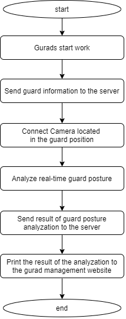
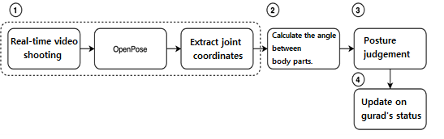
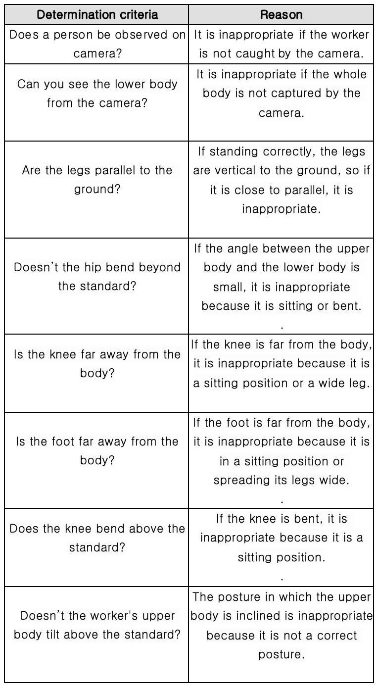
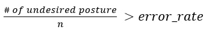
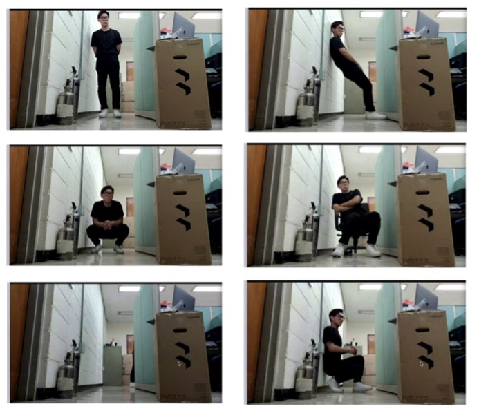
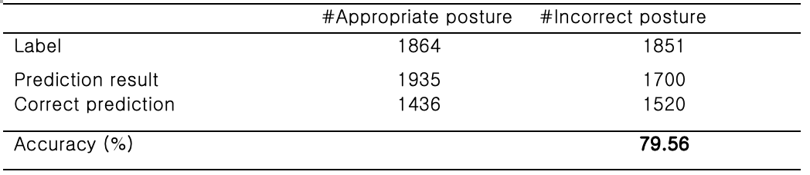
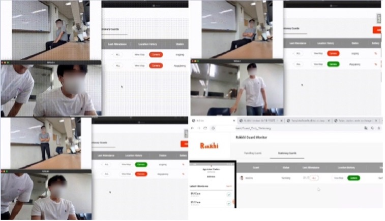
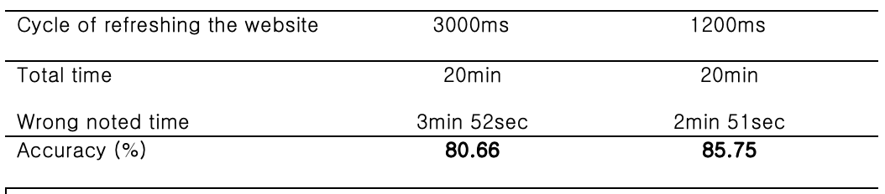

# A real-time monitoring system using OpenPose

## Project Explanation  
Despite the advancement of technology, building guarding systems still have problems that can occur in people, such as poor working attitudes. In addition, monitoring surveillance camera, a solution to this problem, is not automated, so there is a limit. To solve this problem, we propose a real-time monitoring system for workers using OpenPose.
  

## System Flowchart 

 [System Flowchart]  

            
The system proceeds through the process shown in the left picture. When a guard starts working, the application downloaded in the guard's device transmits the guard's information to the server. After checking the guard's information, the server connects the camera corresponding to the guard's work location to the server so that the guard can be checked in real-time on the guard management site. The server receives an image from the camera in real-time, analyzes the posture of the worker using OpenPose, and then shows the results on the guard management website.
  
            
## Real-time analyzing process 

 [Posture decision process]  

Despite the advancement of technology, building guarding systems still have problems that can occur in people, such as poor working attitudes. In addition, monitoring surveillance camera, a solution to this problem, is not automated, so there is a limit. To solve this problem, we propose a real-time monitoring system for workers using OpenPose.

The process for determining posture is shown above. The first step ① is to extract the coordinates of the workers' body joints from the real-time video using the OpenPose model pre-trained into the MPII dataset [2]. In the second step ②, an angle between vectors is calculated by vectorizing body parts with coordinates extracted by OpenPose. The third step is to determine whether the worker is working correctly using the angle calculated by ③. In order to determine the correct posture, eight criteria were prepared to determine various sitting postures and not standing upright, and if all of these criteria were passed, the correct posture was judged. The criteria can be identified in the below table. In the last step ④, the worker's status is updated and shown on the web-based on the determined postures. Several frames are analyzed to prevent workers' status from changing too frequently and being affected by model errors a lot.  

 [Posture Decision Table]  

            
 indicates a case where the employee's posture is updated as being incorrect. n and error_rate are the number of frames to be analyzed when updating the status, and the ratio of frames deemed inappropriate among the frames analyzed. We allow users to designate them so that users can easily determine how many errors they will allow during work.
            
## Result

   

In order to evaluate the performance of the system proposed, images working in various positions were shooted, and a total of 3,715 images were labeled by extracting frames of the images to construct a dataset. An example of the image used in the dataset is shown in the left table above. The results of prediction using the model can be confirmed in the right picture above, and 2,956 out of a total of 3,715 data were accurately predicted, showing 79% performance.   
                

   

In addition, performance evaluation on the web was also conducted, and the experiment was conducted with the site refresh cycle as a variable. The experiment was conducted for 20 minutes for each refresh cycle. Out of 20 minutes, we checked the time that the site's work status notation(green if the right, red if wrong) shows correct posture determination. The results are shown in right table above.  
The first experiment was conducted with a site refresh cycle of 3,000 ms. As a result, it was found that it had an accuracy of 80.66%. To increase the accuracy more, we checked calculation time to analyze the posture of one, and it was confirmed that it took 297ms on average. Since the system reflects the results of the four frames, we modified that the site refresh cycle to 1,200ms, and the accuracy was 85.75%, which is higher than that of the previous experiment.
  
            
<b>Performance Video : </b>  

  
### <a href = "https://drive.google.com/file/d/1rDPtMzLQ1CT7NQP95L0vHKeRt4iYSX-N/view?usp=sharing">[Publication]</a> : Korean Software Congress 2021 (Excellence Prize)
            
### <b>Our real-time monitoring system was adopted by a company called <a href="https://www.rokkhi.com/">"Rokkhi"</a> in recognition of its high performance</b>
### [The code is private at the request of "Rokkhi"]
            